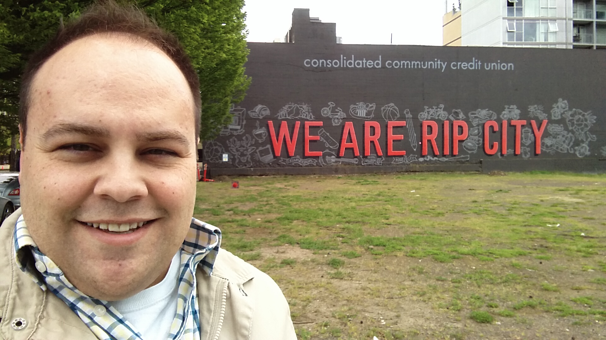

Recently, I had a wonderful opportunity to interview for a security engineer position in Portland, Oregon. The first few interviews were all phone based as I am located in Omaha, Nebraska.  I did well enough in these interviews to get flown out to Portland for a face-to-face interview.  

At this point, I was still a full time developer actively pursuing a career in information security. However, I felt super prepared for this interview.  I had just completed my Master's degree and my OSCP - I was excited and eager to get into the cyber security sector.

#### Interview

<figure class="floatLeft">
    
    <figcaption>I Am Rip City?</figcaption>
</figure>

I arrived a day early so I could tour Portland as much as possible.  It was a blast!

 

After visiting several local hotspots (per recommendations of the awesome recruiter I was in contact with), I ended up going back to the hotel to prepare for the interview and to get a long night's rest.

 

The next day I had three interviews lined up. The first was with two remote engineers - which was a great opportunity as I would also be working remote.  The second interview was with back end and front end engineers.  And the third was with the team I would be a part of if I was hired.  The interviews all went well, I didn't have any issues technical-wise.  I did stumble on a question about making "decision-trees" as I had never required the opportunity to do that, but all-in-all I was pleased.

<figure class="floatRight">
    
    <figcaption>I Think I Could Fit In</figcaption>
</figure>

 

Next was the waiting.  I was extremely excited about the opportunity because this is what I wanted for my career.  I liked the idea of working for a strong, growing company - and getting to spend more time with my 1 year old son and less time driving around town!  The group of people I interviewed with were all extraordinarily intelligent and I knew that given the opportunity, I would learn a great deal from them.

 

After a good deal of waiting, I eventually heard back.  Sadly, they had found another candidate that better fit their needs.  Bummed out as I was, I took the time to write a thank you email and asked for constructive feedback.  How could I make myself a more attractive candidate to the next great opportunity that came along? Certainly I had done well on the technical questions, albeit not absolutely perfectly - I have room to grow!  I wondered what part of the process could have gone better in the future.

The response surprised me - it was both thrilling and puzzling.  I was told that I didn't do anything wrong, they really liked me for the role, however, they simply went with a candidate who had demonstrated more experience - both working with teams and as a "subject matter expert in some areas".

That did make me feel better, at least I knew that they had given me serious consideration and I was in the running.  However, this response also left me with a question.

How can I demonstrate my expertise without going to work in some of the more entry-level portions of the industry?

I definitely don't consider myself entry-level - I'm a senior level developer who has gotten a Master's degree in Cyber Security and passed the OSCP.  How can I demonstrate my knowledge and expertise in information security?  Specifically I was interested in how can I do this for penetration testing (my ideal role in information security).  

My goal was to move into the role/position that was the best fit for me.  After all, I didn't hate my current job, it was a good job with great people, so the fit of the potential infosec position had to be just right.  I need to believe in the company's mission and trust that I will always be able to learn something from my coworkers.  I wanted to - <em>gasp</em> - enjoy the work I was doing.  The last thing I was interested in was going to "pay my dues" in a dull entry-level position. 

#### Daily Hacks

My solution was to add an entirely new section to my little used blog called <a class='table-link' target='_blank' href='https://www.blog.hatsec.io/hacks/'>Daily Hacks</a>.  My goal with this section of my site is to demonstrate a wide variety of exploits, attack vectors, and techniques I used to solve cyber security challenges.  I choose a site, a VM, or a CTF and attempt to solve as many challenges as I can.  The interesting ones I writeup, color code, and format them accordingly.

Although it will not map perfectly 1 challenge to 1 day, I will try to keep up with it as long as I can.  I am a lifelong learner, so even if people do not consider this a demonstration of my experience - at least I learned something along the way.

Feel free to let me know what you think of my solution.  If you have other suggestions how I can demonstrate expertise, please let me know.  I was once told by a good friend:

There is more good work to be done in this industry, then there are good people to do it.  If you know your stuff and do good work, opportunity will find you and you will go far.

And that's what I am going to strive for.

 

 

