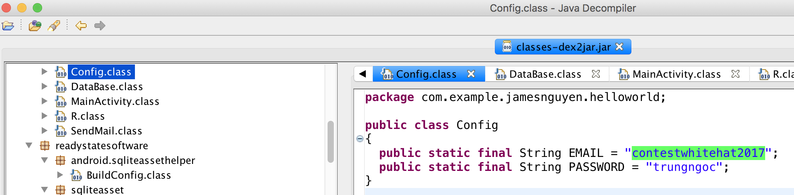
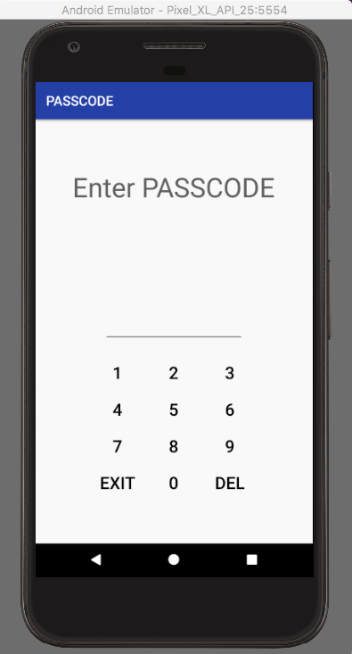
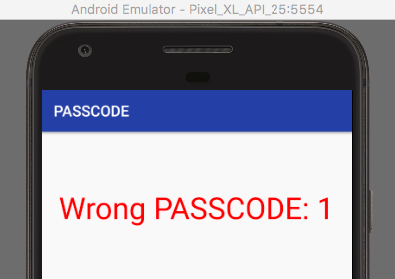
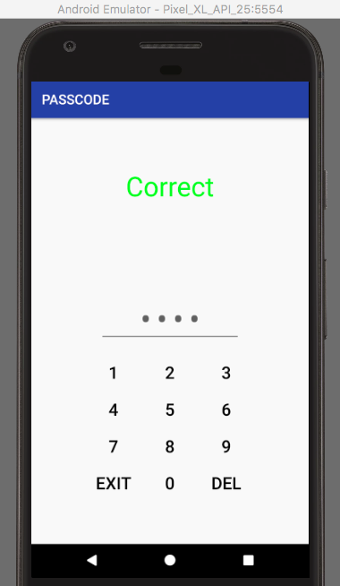
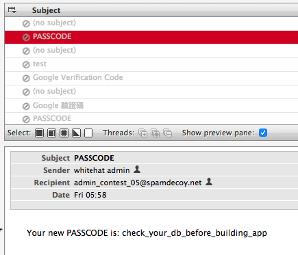

<div class='daily-hack-box'>
	<table class='table'>
		<thead>
		</thead>
		<tbody>
			<tr>
				<th scope='row'>Challenge</th>
				<td>Find sensitive information within the passcode.apk file.</td>
			</tr>
			<tr>
				<th scope='row'>Method</th>
				<td>APK Code Analysis</td>
			</tr>
			<tr>
				<th scope='row'>CTF Link</th>
				<td>
                    <a class='table-link' target='_blank' href='https://wargame.whitehat.vn/Challenges/DetailContest/281'>https://wargame.whitehat.vn/Challenges/DetailContest/281</a>
                </td>
			</tr>
			<tr>
				<th scope='row'>CTF Team</th>
				<td><a class='table-link' target='_blank' href='https://ctftime.org/team/35272'>Broast</a></td>
			</tr>
			<tr>
				<th scope='row'>CTF Handle</th>
				<td>clevernyyyy</td>
			</tr>
			<tr>
				<th scope='row'>Flag</th>
				<td>
                WhiteHat{254eb81a7b439405a5d006eb7cfdf0cd841c6d28}
                </td>
			</tr>
		</tbody>
	</table>
</div>

### Daily Hack #6 Writeup

I ended up having some free time this Memorial Day weekend, so I <a class='table-link' target='_blank' href='https://wargame.whitehat.vn/Contests/ChallengesContest/37'>joined a CTF</a>, and attempted to solve a few challenges.  One, I made harder than it needed to be, but it was fun so I figured I'd write it up.

The challenge statement was super generic, so the problem seemed to amount to basic apk forensics.

<div class='text-response'>
    Can you find my sensitive infomation?
</div>

I haven't actually done any serious apk forensics on my new laptop before, so I'll walk you through the setup in case others are neophytes or have similar issues.

#### Step One: Getting a .jar file

First things first, I downloaded the apk and thought, I'd bet some "sensitive information" is hidden within the java code.  So my goal was to take the apk and convert it to java class code.  To do that I needed to download <a class='table-link' target='_blank' href='https://github.com/pxb1988/dex2jar'>dex2jar</a>, a program made to translate `dex` files to `jar` files.

After I downloaded dex2jar, I took the `classes.dex` file and attempted to run it through dex2jar, but I had permission issues.  I wanted all the dex2jar scripts to run so I set permissions on all the scripts in the folder with the below command, setting every `sh` script to executable.

```bash
chmod a+x ./*.sh
```

Next, I needed to install a Java Runtime Environment, which can be done from Oracle's website. And finally I was ready to run dex2jar!

```
sudo sh d2j-dex2jar.sh -f classes.dex 
```

The above command created a file `classes-dex2jar.jar`.  I knew that I needed to set permissions on this `jar` file in order to open it, so I also ran the command:

```
sudo chmod +xr classes-dex2jar.jar
```

#### Step Two: Examining .jar file

In order to examine the `jar` file, you'll need an IDE that can handle java, I used <a class='table-link' target='_blank' href='http://jd.benow.ca/'>jd-gui</a> to view the files.

One thing that immediately stood out to me was in the `Config.class` file.  It appeared to be a username/email and a password!


<figure>
    
    <figcaption>Flag?</figcaption>
</figure>

This seems like "sensitive information", right?  <b>Wrong</b>.  As far I know it's a total red herring.  I tried several different versions of this for the flag:

<ul>
	<li>trungngoc</li>
	<li>WhiteHat{trungngoc}</li>
	<li>WhiteHat{SHA1(trungngoc)}</li>
</ul>

And none of those worked. I even tried pinging an admin about it, but I got the classic OSCP "try harder" response.  Okay, so if that wasn't the flag maybe it was information <em>leading to the flag.</em>  So I thought, maybe this username and password matters on the application - I need to run and login to view the sensitive information.

#### Step Three: Emulating the .apk

Once again, new laptop, new setup.  These are the steps to emulate the `apk`.  I needed to install <a class='table-link' target='_blank' href='https://developer.android.com/studio/releases/platform-tools.html'>android-platform-tools</a> and <a class='table-link' target='_blank' href='https://developer.android.com/studio/index.html'>android studio</a> in order to emulate the `apk` properly.

I simply downloaded Android Studio from the above link, but used homebrew for the android-platform-tools.

```
brew cask install android-platform-tools
```

Next, I added a new Android Virtual Device through Android Studio's AVD Manager, and started up the emulator.  

```
emulator -avd Pixel_XL_API_25
```


Lastly, I ran this command to attach the `apk` to the emulator:

```
adb -e install -r passcode.apk 
```

Next thing you know I have the world's most pointless Android application running.  Seems it's looking for a four digit passcode.

<figure>
    
    <figcaption>Passcode Application</figcaption>
</figure>

This isn't what I expected.  I thought there would be a username/email and password field. Hmmmm, okay let's try some four digit pins. How about 1-1-1-1?

<figure>
    
    <figcaption>Passcode Wrong</figcaption>
</figure>

How about 2-2-2-2?  Wrong again.  Okay, 3-3-3-3.  Correct.  Wait, what!?  It says it's correct, but doesn't do anything...  I try to consider the different ways I can use 3-3-3-3 to gain access to further parts of the challenge, but it all seems wrong. I think I have gone down the wrong path and need to pivot again.


<figure>
    
    <figcaption>Passcode Correct</figcaption>
</figure>


At this point, I'm pretty spent, so I go to bed and wake up the next day with fresh eyes.  Ah, there's a `sqlite` database in the `assets` directory.  I wonder if that's a good place to explore next.

#### Step Four: SQLite

Browse to the `assets` directory `cd passcode/assets` and open the sqlite database with the command:

```
sqlite3 passcode.sqlite 
```

First thing to do in a sql db is to check what tables are available.

```sql
sqlite> .tables
user     zadminz
```

I checkout the `zadminz` table first.

```sql
sqlite> select * from zadminz; 
1|admin_contest_05@spamdecoy.net|7777
```

This looks interesting, so I browse to www.spamdecoy.net, which appears to allow logins with only email addresses, no passwords required.  So I login as `admin_contest_05` and click through admin's emails.  There is one email that stands out.  It could be the flag, but I've been fooled before!


<figure>
    
    <figcaption>Flag?</figcaption>
</figure>


As it turns out it was the flag, just needed to SHA1 it and add the contest name bracketing.  This challenge turned out to be much easier than I initially anticipated, but at least I got my new laptop setup for future Android apk challenges!

```
WhiteHat{254eb81a7b439405a5d006eb7cfdf0cd841c6d28}
```

