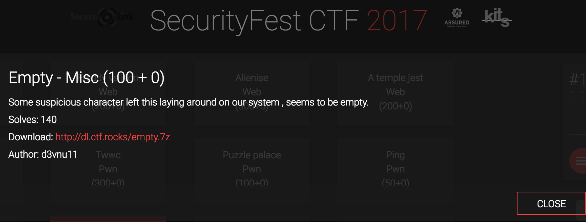
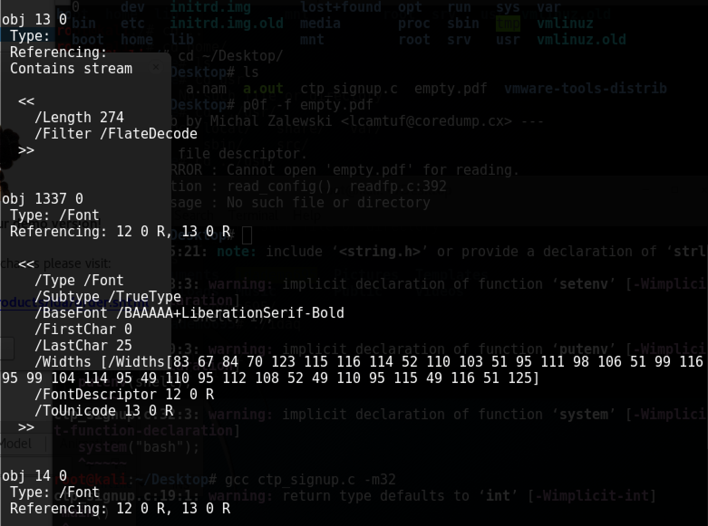

<div class='daily-hack-box'>
	<table class='table'>
		<thead>
		</thead>
		<tbody>
			<tr>
				<th scope='row'>Challenge</th>
				<td>Find flag within PDF.</td>
			</tr>
			<tr>
				<th scope='row'>Method</th>
				<td>PDF Forensics & Steganography</td>
			</tr>
			<tr>
				<th scope='row'>CTF Link</th>
				<td>
                    <a class='table-link' target='_blank' href='http://dl.ctf.rocks/empty.7z'>http://dl.ctf.rocks/empty.7z</a>
                </td>
			</tr>
			<tr>
				<th scope='row'>CTF Team</th>
				<td><a class='table-link' target='_blank' href='https://ctftime.org/team/35272'>Broast</a></td>
			</tr>
			<tr>
				<th scope='row'>CTF Handle</th>
				<td>clevernyyyy</td>
			</tr>
			<tr>
				<th scope='row'>Flag</th>
				<td>
                	SCTF{str4ng3_obj3ct_chr_1n_pl41n_s1t3}
                </td>
			</tr>
		</tbody>
	</table>
</div>

### Daily Hack #7 Writeup

I joined the 2017 <a class='table-link' target='_blank' href='https://securityfest.ctf.rocks'>SecurityFest CTF</a> during a boring meeting and ended up playing it throughout the night.  This would be a good CTF for a security team, lots of diverse questions, highly recommend it.  This challenge ended up being a PDF forensics challenge.  I was greeted with the following message and a PDF download.

<figure>
    
    <figcaption>PDF Challenge Statement</figcaption>
</figure>


After downloading, the first thing I did was verify the PDF was created properly (and actually a PDF) with the command `file empty.js`...

And opening the file in a hex editor to verify it's headers did in fact indicate a PDF through my favorite <a class='table-link' target='_blank' href='https://digital-forensics.sans.org/media/hex_file_and_regex_cheat_sheet.pdf'>hex file and regex cheat sheet.</a>

In both cases, everything seemed accurate.  I know that I have a few Kali tools for pdf forensics, specifically:

<ul>
	<li><a class='table-link' target='_blank' href='http://tools.kali.org/forensics/pdf-parser'>pdf-parse</a></li>
	<li><a class='table-link' target='_blank' href='http://tools.kali.org/forensics/peepdf'>peepdf</a></li>
	<li><a class='table-link' target='_blank' href='http://tools.kali.org/forensics/pdfid'>pdfid</a></li>
</ul>


So I start up my Kali VM and transfer `empty.pdf` over and simply run `pdf-parser empty.pdf`.  The results seemed ordinary at first as I scrolled through them, however eventually I stumbled upon obj marked with `1337` which is a telltale sign I need to investigate it further.


<figure>
    
    <figcaption>PDF Parser Results</figcaption>
</figure>


In the above picture note the widths.  That appears to be an array ending in 125, which is likely a flag, because `125` is `}` in decimal.  


```
83 67 84 70 123 115 116 114 52 110 103 51 95 111 98 106 51 99 116 95 99 104 114 95 49 110 95 112 108 52 49 110 95 115 49 116 51 125
```

Copying the above array into <a class='table-link' target='_blank' href='http://www.asciitohex.com/'>asciitohex.com</a>'s decimal field results in the plaintext flag.

```
SCTF{str4ng3_obj3ct_chr_1n_pl41n_s1t3}
```
