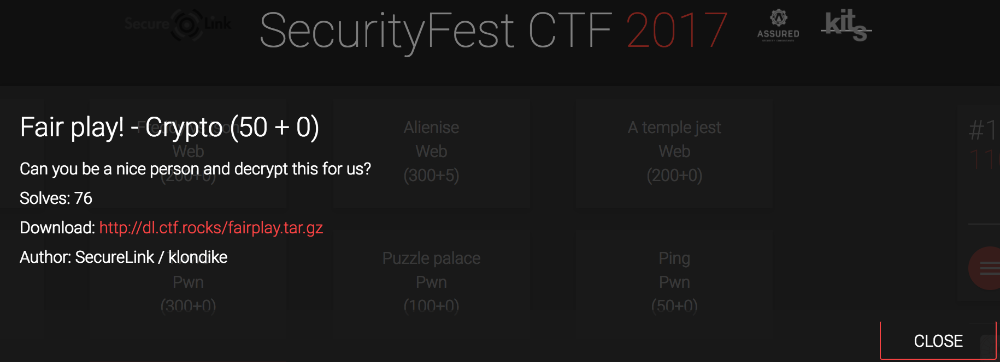
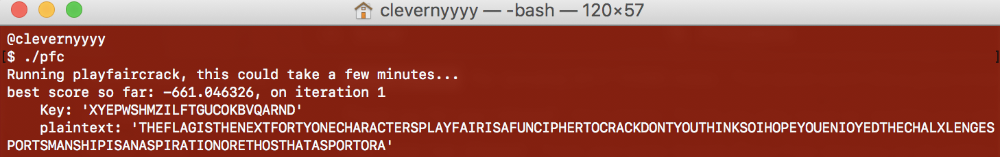

<div class='daily-hack-box'>
	<table class='table'>
		<thead>
		</thead>
		<tbody>
			<tr>
				<th scope='row'>Challenge</th>
				<td>Decrypt the attached ciphertext.</td>
			</tr>
			<tr>
				<th scope='row'>Method</th>
				<td>Simulated Annealing Algorithm</td>
			</tr>
			<tr>
				<th scope='row'>CTF Link</th>
				<td>
                    <a class='table-link' target='_blank' href='http://dl.ctf.rocks/fairplay.tar.gz'>http://dl.ctf.rocks/fairplay.tar.gz</a>
                </td>
			</tr>
			<tr>
				<th scope='row'>CTF Team</th>
				<td><a class='table-link' target='_blank' href='https://ctftime.org/team/35272'>Broast</a></td>
			</tr>
			<tr>
				<th scope='row'>CTF Handle</th>
				<td>clevernyyyy</td>
			</tr>
			<tr>
				<th scope='row'>Flag</th>
				<td>
                SCTF{PLAYFAIRISAFUNCIPHERTOCRACKDONTYOUTHINKSO}
                </td>
			</tr>
			<tr>
				<th scope='row'>Sources</th>
				<td>
                <a class='table-link' target='_blank' href='http://practicalcryptography.com/cryptanalysis/stochastic-searching/cryptanalysis-playfair/'>Practical Cryptography</a>
                </td>
			</tr>
		</tbody>
	</table>
</div>

### Daily Hack #8 Writeup

I joined the 2017 <a class='table-link' target='_blank' href='https://securityfest.ctf.rocks'>SecurityFest CTF</a> during a boring meeting and ended up playing it throughout the night.  This would be a good CTF for a security team, lots of diverse questions, highly recommend it.  This challenge ended up being a PlayFair cipher challenge.  I was greeted with the following message and the below ciphertext.

<figure>
    
    <figcaption>Playfair Challenge Statement</figcaption>
</figure>

<br>

```
FMYTFQUZMLMYRPELOAEKHARPOSRNQOKMQMXGYHOYMDSHYOGDVSYZMEFKKQQOVRBAFEVFFMZDCMVHFAWPHATWDZAHWRFMXKFYCSTXPBXMYBEKHZRDHMZWSHRDQHWZNRUMBAKAMKFAMLFYFRZXKAFKNRKLUDMUEXSUGCPYPRHVEPAUKAMUHCPDHQRMIUFMENBYMEOKQZUWMERFHVAGKAOYMDRPLSMXFMSVMQXMWPKLRDQRMXQZYKLYTYCSFCXIMSWXMUFARPLQKHWPUMFKQMQHKAXTCHMEEMTYQMFKBAPXFAAVXMABLEFRRMRWTYRFXPCSUXMYEMQHNFCYVAZXKAKTYRQZKPZDFNFBVAIUQPRPNRIXXTFQZCWMPBNFCYVAFCMXQMKHYKRPYICHFAXIOKTDKMHXFKYDNQHQABFMMEZDQHYBEKZLRHXMYBEKHZRDHMZWOQPNXKBAKXEGFDUSMPQRHQRPDQTDZDFNDQEMFQUMKWFXMLNOTXOSRNQOKMDMMLSVKAWUZXCHMUHVQZLVMFFYUMDQUDUWFDCLWULYTYDMRGMYYDEFMYHYEMTPRPNRCSFXPYWPKLWRFKK....
```
<figure>
    <figcaption>Ciphertext (Concatenated for Brevity)</figcaption>
</figure>

<br>


The challenge statement indicated that this was a Playfair cipher, something that I was totally not familiar before approaching this problem.  <em>(Side note, that's one of the things I love about CTFs - you get exposure to stuff you've never seen before.)</em>

I had to do some research about Playfair ciphers and right away it was apparent that I would need to likely brute force the grid used to encrypt.  There are not a lot of good online tools for brute forcing Playfair cipher grids.  However, there was an interesting academic algorithm that seemed to make the most sense to me.

I found this method on <a class='table-link' target='_blank' href='http://practicalcryptography.com/cryptanalysis/stochastic-searching/cryptanalysis-playfair/'>Practical Cryptography</a>'s website that discussed a simulated annealing algorithm.

<br>

<em>Stealing from Wikipeida:</em>

<div class='text-response'>
	Simulated annealing (SA) is a probabilistic technique for approximating the global optimum of a given function. Specifically, it is a metaheuristic to approximate global optimization in a large search space. It is often used when the search space is discrete.
</div>

<em>So, to translate why this algorithm would help us brute force a Playfair grid:</em>

<div class='text-response'>
	Each time we attempt a grid solution, we approximate the accuracy of the soluion.  In this case, the accuracy of English words in the decrypted ciphertext.
</div>


Okay, now that I understand what this is doing, I pull the files off of the Practical Cryptography's website.

<ul>
	<li>playfaircrack.c </li>
	<li>scoreText.h</li>
	<li>scoreText.c</li>
	<li>qgr.h</li>
</ul>


I edit `playfaircrack.c` and change the ciphertext array to:

```
char cipher[]  = "FMYTFQUZMLMYRPELOAEKHARPOSRNQOKMQMXGYHOYMDSHYOGDVSYZMEFKKQQOVRBAFEVFFMZDCMVHFAWPHATWDZAHWRFMXKFYCSTXPBXMYBEKHZRDHMZWSHRDQHWZNRUMBAKAMKFAMLFYFRZXKAFKNR";    
```

That's obviously not entire ciphertext, but I assume if I find a proper grid and the flag is not within the first 150 characters, I can solve the rest with the grid.  Next, I compile as they tell me:

```
gcc -O3 -lm playfaircrack.c scoreText.c -o pfc
```

And finally run the program - which finds the solution instantly!


<figure>
    
    <figcaption>Playfair Solution</figcaption>
</figure>

<br>

So the flag is: 
```
SCTF{PLAYFAIRISAFUNCIPHERTOCRACKDONTYOUTHINKSO}
```

I have to admit, at first I tried running this program with the entire cipher text, then under 100 characters, then finally with 150 characters of the ciphertext.  The latter obviously worked the best.  I'm excited to use more simulated annealing algorithms in the future, maybe for a fun challenge, I'll translate this to python!

<br>


