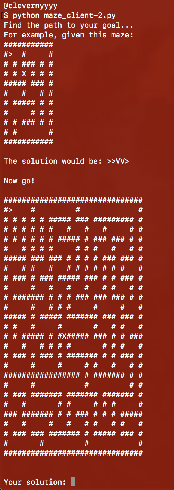
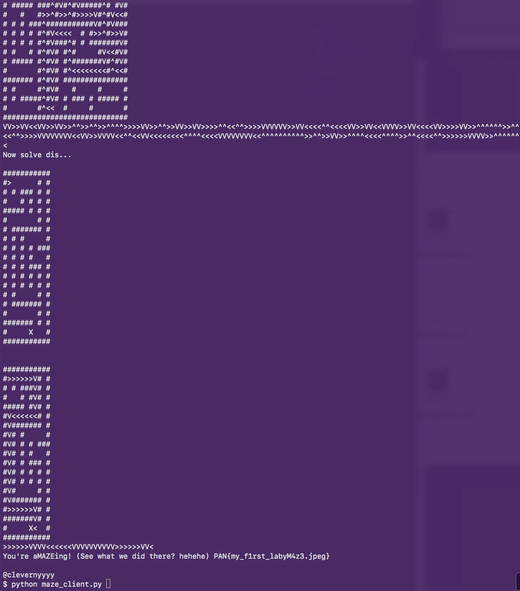
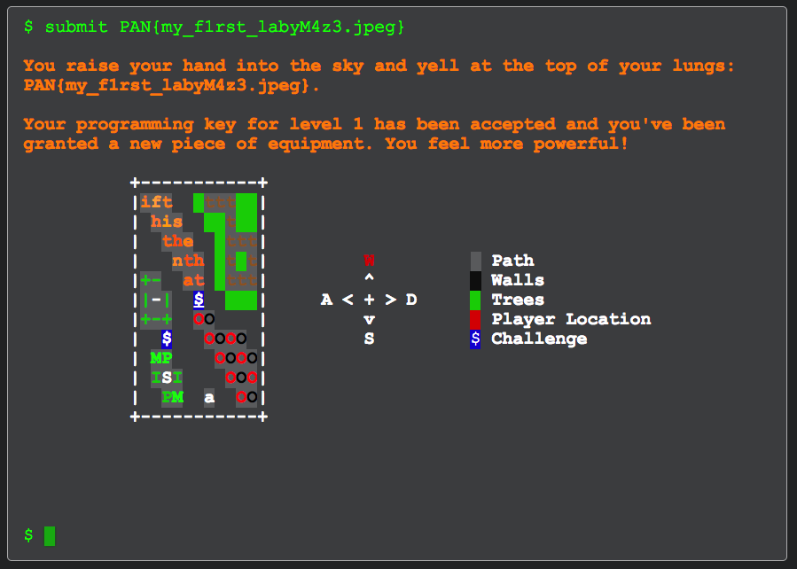

<div class='daily-hack-box'>
	<table class='table'>
		<thead>
		</thead>
		<tbody>
			<tr>
				<th scope='row'>Challenge</th>
				<td>Script a maze solver and output the path of solution.</td>
			</tr>
			<tr>
				<th scope='row'>Method</th>
				<td>Python Scripting</td>
			</tr>
			<tr>
				<th scope='row'>CTF Link</th>
				<td>
                    <a class='table-link' target='_blank' href='https://labyrenth.com/mud/'>https://labyrenth.com/mud/</a>
                </td>
			</tr>
            <tr>
                <th scope='row'>CTF Team</th>
                <td><a class='table-link' target='_blank' href='https://ctftime.org/team/35272'>Broast</a></td>
            </tr>
            <tr>
                <th scope='row'>CTF Handle</th>
                <td>clevernyyyy</td>
            </tr>
            <tr>
				<th scope='row'>Flag</th>
				<td>
                	PAN{my_f1rst_labyM4z3.jpeg}
                </td>
			</tr>
		</tbody>
	</table>
</div>

### Daily Hack #9 Writeup

Extracting the zip download for this challenge shows me a python socket challenge - specifically a maze scripting challenge.

Here's the original code:

```python
from socket import create_connection
MAZE_SERVER = ('54.69.145.229', 16000)
RECV_SIZE = 8192

def main():
    conn = create_connection(MAZE_SERVER)
    response = conn.recv(RECV_SIZE)
    while True:
        print response
        if "Now " not in response:
            return

        response_lines = response.splitlines()
        find_delim = [x for x in response_lines if x.startswith('Now')][0]
        maze_lines = response_lines[response_lines.index(find_delim)+2:-1]
        maze_text = '\n'.join(maze_lines)

        # Do your thing here with either maze_text or maze_lines.

        solution = raw_input("Your solution: ")
        if not len(solution):
            return
        conn.send(solution)

        response = conn.recv(RECV_SIZE)

if __name__ == '__main__':
    main()
```


<figure class='floatLeft'>
    
    <figcaption>Python Maze Challenge</figcaption>
</figure>


These type of python maze problems are actually really common because they teach recursion techniques.  I've done many python maze problems in the past, so I went to attempt to adapt one of my old scripts for this challenge. I usually injest the maze as a list of lists of single character strings.

Example from the first two lines on the left:  
```
[['#','#','#','#','#','#','#','#','#','#','#'],
 ['#','>',' ',' ','#',' ',' ',' ',' ',' ','#'],
 ...
]
```

So I had to change how the default script injested the maze by adding this line:

`maze = [list(row) for row in maze_text.splitlines()]`


Next, I added a recursion function to solve the maze.  Most challenges like this have you print the maze so I also had to add a method for storing the path as I solve the maze.  One issue could be if they are looking for the shortest path solution.  I don't have that coded already.  Below is my script to solve the maze challenge:

<br>
<br>


```python
from socket import create_connection
MAZE_SERVER = ('54.69.145.229', 16000)
RECV_SIZE = 8192
path = []

def main():
    conn = create_connection(MAZE_SERVER)
    response = conn.recv(RECV_SIZE)
    while True:
        print response
        if "Now " not in response:
            return

        response_lines = response.splitlines()
        find_delim = [x for x in response_lines if x.startswith('Now')][0]
        maze_lines = response_lines[response_lines.index(find_delim)+2:-1]
        maze_text = '\n'.join(maze_lines)

        location = []
        hasNoEnd = True
        maze = [list(row) for row in maze_text.splitlines()]

        for y in range(0, len(maze)):
            for x in range(0, len(maze[y])):
                if maze[y][x] == '>':
                    location = [y,x]
                elif maze[y][x] == 'X':
                    hasNoEnd = False
        if hasNoEnd:
            raise Exception('unsolvable')

        tick(maze, location[0], location[1])
        solution = get_solution(maze)
        conn.send(solution)
        response = conn.recv(RECV_SIZE)

def get_solution(maze):
    if len(path) > 0:
        print('\n'.join(''.join(row) for row in maze))
        solution = ''.join(path)[::-1]
        print solution
        global path 
        path = []
        return solution

def tick(maze, y, x):
    if maze[y][x] in (' ', '>'):
        tag = 'o'
        maze[y][x] = tag
        #check right, down, left, up
        if tick(maze, y, x+1) == True :  #right
            tag = '>'
            path.append(tag)
        elif tick(maze, y+1, x) == True :  #down
            tag = 'V'
            path.append(tag)
        elif tick(maze, y, x-1) == True :  #left
            tag = '<'    
            path.append(tag)  
        elif tick(maze, y-1, x) == True :  #up
            tag = '^'
            path.append(tag)
        else:
            tag = ' '
        maze[y][x] = tag
        return (tag != ' ')  
    elif maze[y][x] == 'X':
        return True #start peeling back.  
    return False

if __name__ == '__main__':
    main()
```

After I ran this script, I got a few errors. I wasn't sure why, the path seemed correct AND it seemed to be the shortest path.  However, I just ran it a few more times, and at one point it solved all the necessary mazes and output the flag.

<figure>
    
    <figcaption>Maze Flag</figcaption>
</figure>

<br>

All I had to solve was five mazes and I got the flag.  As you can see, it is extremely handy to save common scripts like this, it really cut down on the solving time.


```
PAN{my_f1rst_labyM4z3.jpeg}
```


<figure>
    
    <figcaption>Amazing Solution</figcaption>
</figure>


<br>