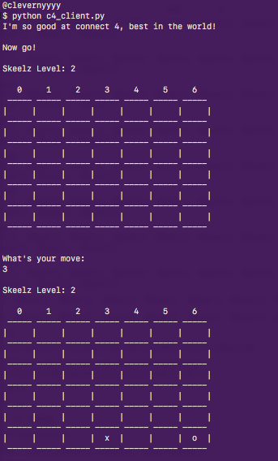
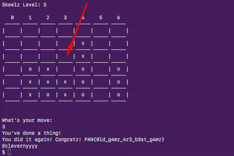

<div class='daily-hack-box'>
	<table class='table'>
		<thead>
		</thead>
		<tbody>
			<tr>
				<th scope='row'>Challenge</th>
				<td>Script a connect four solver to beat AI opponent.</td>
			</tr>
			<tr>
				<th scope='row'>Method</th>
				<td>Python Scripting</td>
			</tr>
			<tr>
				<th scope='row'>CTF Link</th>
				<td>
                    <a class='table-link' target='_blank' href='https://labyrenth.com/mud/'>https://labyrenth.com/mud/</a>
                </td>
			</tr>
            <tr>
                <th scope='row'>CTF Team</th>
                <td><a class='table-link' target='_blank' href='https://ctftime.org/team/35272'>Broast</a></td>
            </tr>
            <tr>
                <th scope='row'>CTF Handle</th>
                <td>clevernyyyy</td>
            </tr>
            <tr>
				<th scope='row'>Flag</th>
				<td>
                	PAN{0ld_g4mz_4r3_b3st_g4mz}
                </td>
			</tr>
		</tbody>
	</table>
</div>


### Daily Hack #10 Writeup

Extracting the zip download for this challenge resulted in a python socket challenge, so I know that this will be a scripting challenge.

Here's the original code:

```python
import socket
C4_SERVER = ('52.40.187.77', 16000)
RECV_SIZE = 4096

def main():
    conn = socket.create_connection(C4_SERVER)
    response = conn.recv(RECV_SIZE)
    while True:
        print response
        if 'Skeelz' not in response:
            return

        # Do a thing here.

        move = raw_input("")
        if not len(move):
            return
        conn.send(move)
        response = conn.recv(RECV_SIZE)

if __name__ == '__main__':
    main()
```


<figure class='floatRight'>
    
    <figcaption>Running Client Script</figcaption>
</figure>


Clearly they have a spot for a scripted solution.  Like other, similar CTF challenges, I figure the AI will get harder and harder to beat and the time to solve will get shorter and shorter.  This is a standard practice; done to allow a user to see how to solve a challenge without allowing them to do it manually.  But, to put my assumptions to a test, I run the client as is.

<br>

Sure enough, I'm able to beat the first two AI levels and run out of time on the third. Something most people don't know about me is that <em>I love Connect Four</em>.  It was one of my favorite games as a child because I almost never lost.  In fact, I cannot remember the last time I lost a game of Connect Four.  I know that it is a "solved game", meaning that there is a way for the first player to always win.  

Source: <a class='table-link' target='_blank' href='http://connect4.gamesolver.org/'>http://connect4.gamesolver.org/</a>

<br>

So I restart the script and play as fast as I can.  I was able to beat the first three levels, but again ran out of time on the fourth level.  Okay, I thought, I'll try one more time and then script the solution.  On my second speed round, I noticed that I was able to beat levels 1 and 2 with the same method and level three appeared to be the same as well.  Therefore, on level 4 I played all the same moves and again ran out of time.  I noticed that the AI was replying to my moves the <em> same way everytime.</em>  This is important for two reasons:

<ol>
	<li>I can speed up my solution by scripting the first three levels.</li>
	<li>I can actually test level four (and script that too) without having to make my own solver algorithm.  It is simply a matter of printing the AI opponent's responses to different situations and scripting up until I run out of time, then repeating the process until I have a solution.  This would work with any number of levels beyond level four.</li>
</ol>


<div class='text-response'>
	Note:  While this may seem like cheating, there's really no such thing in a CTF.  If you are penetration testing an environment on an engagement and notice the cookie is always the same - you know that you may be able to reverse the authentication credentials.  This is the mindset of a "hacker".
</div>


So I set about testing my new theory.  As I said, I scripting the first three levels were easy and then I started testing the fourth level a few moves at a time.  If I found a good path, I'd add it to the script and repeat, picking up where my script leaves off.  With this method I was able to solve level four in just a few iterations.  


```python
import socket
C4_SERVER = ('52.40.187.77', 16000)
RECV_SIZE = 4096

def main():
    conn = socket.create_connection(C4_SERVER)
    response = conn.recv(RECV_SIZE)
    n = -1
    while True:
        n += 1
        print response
        if 'Skeelz' not in response:
            return
        move_list = [
            '3','2','4','6','1',					#level 1
            '3','2','4','6','1',					#level 2
            '3','2','1','3','2','3','2','4','4',	#level 3
            '3','1','2','2','4','1','4'				#level 4 - center column fork wins game
        ]

        if n < len(move_list):
            move = move_list[n]
        else:
            move = '3'								#center col fork

        if not len(move):
            return
        print move
        conn.send(move)
        response = conn.recv(RECV_SIZE)

if __name__ == '__main__':
    main()
```


<figure>
    
    <figcaption>Connect Four Flag</figcaption>
</figure>

<br>

As it turns out, level four was the last level, so I got the flag for my efforts!


```
PAN{0ld_g4mz_4r3_b3st_g4mz}
```

<br>