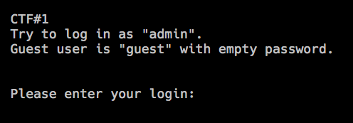
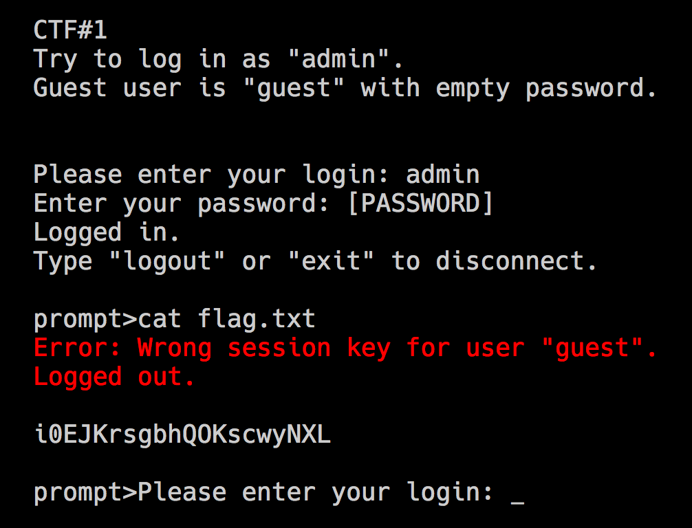

<div class='daily-hack-box'>
	<table class='table'>
		<thead>
		</thead>
		<tbody>
			<tr>
				<th scope='row'>Challenge</th>
				<td>Break into online shell's admin account.</td>
			</tr>
			<tr>
				<th scope='row'>Method</th>
				<td>HTTP Parameter Pollution (HPP)</td>
			</tr>
			<tr>
				<th scope='row'>Link</th>
				<td><a class='table-link' target='_blank' href='https://hack.me/103164/online-shell-hack.html'>https://hack.me/103164/online-shell-hack.html</a></td>
			</tr>
			<tr>
				<th scope='row'>Flag</th>
				<td>i0EJKrsgbhQOKscwyNXL</td>
			</tr>
		</tbody>
	</table>
</div>

### Daily Hack #1 Writeup
Opening the sandbox and I was greeted with this prompt:


<figure>
	
	<figcaption>Login Prompt</figcaption>
</figure>

The first thing I did was open Chrome's dev tools and immediately notice this piece of JS in a `<script/>` tag.

```js
var login = "", sessionKey = "";
function getHTTP(url) {
	var xhr = new XMLHttpRequest();
	xhr.open("GET", url, false);
	xhr.send(null);
	return xhr.responseText;
}
function enterLogin(input) {
	if (getHTTP("request.php?m=login&l="+input) == "ok") {
		login = input; // Saves the login
		currentTerminalFunction = enterPassword; // Set the next function
		terminalInPasswordMode = true; // Indicate that the user will type a password
		terminalPrint("Enter your password: ");
	} else {
		terminalPrint("<span style=\"color:#FE0000;\">Error: This login does not exists!</span><br /><br />Please enter your login: ");
	}
}
function enterPassword(input) {
	terminalInPasswordMode = false;
	var resp = getHTTP("request.php?m=password&l="+login+"&p="+input);
	if (resp !== "error") {
		sessionKey = resp;
		terminalPrint("Logged in.<br />Type \"logout\" or \"exit\" to disconnect.<br /><br />prompt>");
		currentTerminalFunction = prompt;
	} else {
		terminalPrint("<span style=\"color:#FE0000;\">Error: Wrong password!</span><br /><br />Please enter your login: ");
		currentTerminalFunction = enterLogin;
	}
}
function prompt(input) {
	var resp = getHTTP("request.php?m=prompt&l="+login+"&s="+sessionKey+"&c="+encodeURIComponent(input));
	if (resp.startsWith("#error_log_out#")) { // On error, or logout
		terminalPrint(resp.substr(15));
		terminalPrint("Please enter your login: ");
		currentTerminalFunction = enterLogin;
	} else {
		terminalPrint(resp);
	}
}
var currentTerminalFunction = enterLogin;
var terminalContent = "CTF#1<br />Try to log in as \"admin\".<br />Guest user is \"guest\" with empty password.<br /><br /><br />Please enter your login: ";
```

The key line of this is line 19 above, where the program makes a request to login.  We can exploit this line with HTTP Parameter Pollution.  Note the that script takes our input and puts it directly into a request query.  This is a big red flag because a program should never take user input and use it directly without some form of sanitization.

```js
var resp = getHTTP("request.php?m=password&l="+login+"&p="+input);
```

I can login with a username of `admin` and for the password I simply enter `&l=guest&p=`.  As you can see this makes the request into:

```js
var resp = getHTTP("request.php?m=password&l="+"admin"+"&p="+"&l=guest&p=")
```

Which allows `guest` to login as `admin`.  Next, I simply `cat flag.txt` and I have the flag!

<figure>
	
	<figcaption>HPP Solution</figcaption>
</figure>

