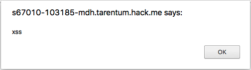
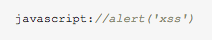

<div class='daily-hack-box'>
	<table class='table'>
		<thead>
		</thead>
		<tbody>
			<tr>
				<th scope='row'>Challenge</th>
				<td>Find and exploit a XSS vulnerability in the link shortening website.</td>
			</tr>
			<tr>
				<th scope='row'>Method</th>
				<td>Cross-Site Scripting (XSS)</td>
			</tr>
			<tr>
				<th scope='row'>Link</th>
				<td><a class='table-link' target='_blank' href='https://hack.me/103185/link-shortening-website-xss.html'>https://hack.me/103185/link-shortening-website-xss.html</a></td>
			</tr>
			<tr>
				<th scope='row'>Flag</th>
				<td>
					
				</td>
			</tr>
		</tbody>
	</table>
</div>

### Daily Hack #3 Writeup
The link-shortener website appears to take a long link input and convert it to a shorter link , then displays an anchor tag on the page for quick reference.  Initial investigation seems everything is in order.  There is a `link_shortener.js` file which shortens with this function:

```js
  function shortenLink (link) { 
    $.get("/ajax/shorten.php", { 
      "link": link
    }, null, "text")
      .done(handleResponse)
      .fail(error.bind(null, null));
  }
```

This seems normal, so I investigate further.  Instead of entering a legit URL, I enter `<script>alert('xss')</script>` which pops a modal:

<div class='text-response'>
	Please insert a valid URL!
</div>

Okay, there appears to be a whitelist or filter on the input.  The <a class='table-link' target='_blank' href='https://secure.php.net/manual/en/filter.filters.validate.php'>first good google result</a> for "filter URL php" gives me some hints.  

As you can see, the long link input must be a valid URL.  After some more testing, I noted that specifically the filter is looking for the URI portion of the input.  For example, `http://` or `ftp://` work, but `google.com` does not work.  This points me in the direction of a javascript directive, found commonly in multiple <a class='table-link' target='_blank' href='https://www.owasp.org/index.php/XSS_Filter_Evasion_Cheat_Sheet#Image_XSS_using_the_JavaScript_directive'>XSS Filter Evasion Cheatsheets</a>.

Unfortunately, when using the input of `javascript:alert('xss')`, I again get the error message:

<div class='text-response'>
	Please insert a valid URL!
</div>

However, using `javascript://alert('xss')` gets through the filter and a short link is formed. When clicking on the short link, you are redirected to a blank page.  Opening the Chrome inspector provides clarity:

```html
<body>
	<a href="javascript://alert('xss')" style="display: none;">
		<script>
		  document.getElementsByTagName("a")[0].click();
		</script>
	</a>
</body>
```

It seems the redirection is performed by the clicking of a formed href.  In this example, the href reads as `javascript:` and that's it.  The `//` comments out the rest of the line.  The goal is now to figure out how to avoid the `//` in order to execute xss.  

<figure>
	
	<figcaption>Commented out JS</figcaption>
</figure>


Initially, I tried a lot of ways around the `//` characters, but was unsucessful.  It was much later that I realized that `//` was a SINGLE line comment.  By using a newline character, I could still execute my code.


Using `%0A` as an url encoded newline character then provided the final solution:  

```js
javascript://%0Aalert('xss')
```

Which renders as:

```js
javascript://
alert('xss')
```

And of course when we click the anchor tag now, we get our sweet xss popup.


<figure>
	
	<figcaption>XSS Alert</figcaption>
</figure>


