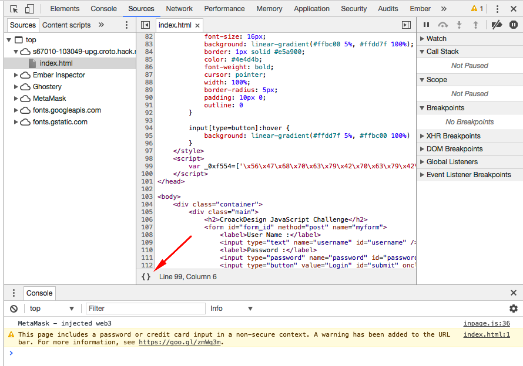
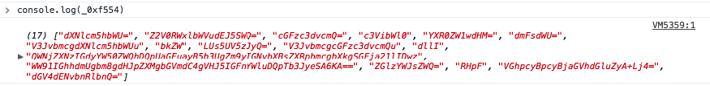
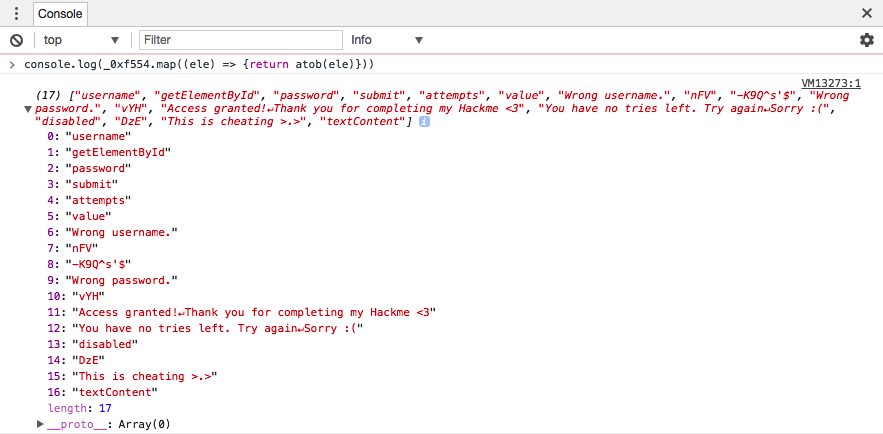
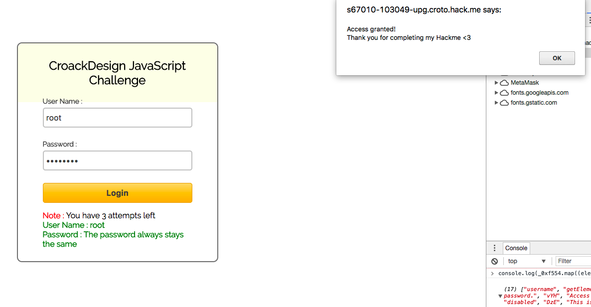

<div class='daily-hack-box'>
	<table class='table'>
		<thead>
		</thead>
		<tbody>
			<tr>
				<th scope='row'>Challenge</th>
				<td>Bypass login by decrypting obfuscated javascript</td>
			</tr>
			<tr>
				<th scope='row'>Method</th>
				<td>Static Code Analysis & Reversing</td>
			</tr>
			<tr>
				<th scope='row'>Link</th>
				<td><a class='table-link' target='_blank' href='https://www.blesciasw.it/2017/05/08/challenge-javascript-encryption-nr-3-medium-hack-me/'>https://www.blesciasw.it/2017/05/08/challenge-javascript-encryption-nr-3-medium-hack-me/</a></td>
			</tr>
			<tr>
				<th scope='row'>Password</th>
				<td>-K9Q^s'$</td>
			</tr>
		</tbody>
	</table>
</div>

### Daily Hack #4 Writeup
Opening the sandbox and I was greeted with this prompt:


<figure>
	
	<figcaption>Login Prompt</figcaption>
</figure>

After entering a username of `root` and a password of `toor` I received a login error message.  I also noticed that during this exchange, there was no request made.  Therefore, this challenge validates inside of some javascript.  The piece of javascript appeared to be a huge single line of code within the `index.html`, so I knew I was going to have to de-obfuscate it.


```html
	<script>
		var _0xf554=['\x56\x47\x68\x70\x63\x79\x42\x70\x63\x79\x42\x6a\x61\x47\x56\x68\x64\x47\x6c\x75\x5a\x79\x41\x2b\x4c\x6a\x34\x3d','\x64\x47\x56\x34\x64\x45\x4e\x76\x62\x6e\x52\x6c\x62\x6e\x51\x3d','\x64\x58\x4e\x6c\x63\x6d\x35\x68\x62\x57\x55\x3d','\x5a\x32\x56\x30\x52\x57\x78\x6c\x62\x57\x56\x75\x64\x45\x4a\x35\x53\x57\x51\x3d','\x63\x47\x46\x7a\x63\x33\x64\x76\x63\x6d\x51\x3d','\x63\x33\x56\x69\x62\x57\x6c\x30','\x59\x58\x52\x30\x5a\x57\x31\x77\x64\x48\x4d\x3d','\x64\x6d\x46\x73\x64\x57\x55\x3d','\x56\x33\x4a\x76\x62\x6d\x63\x67\x64\x58\x4e\x6c\x63\x6d\x35\x68\x62\x57\x55\x75','\x62\x6b\x5a\x57','\x4c\x55\x73\x35\x55\x56\x35\x7a\x4a\x79\x51\x3d','\x56\x33\x4a\x76\x62\x6d\x63\x67\x63\x47\x46\x7a\x63\x33\x64\x76\x63\x6d\x51\x75','\x64\x6c\x6c\x49','\x51\x57\x4e\x6a\x5a\x58\x4e\x7a\x49\x47\x64\x79\x59\x57\x35\x30\x5a\x57\x51\x68\x44\x51\x70\x55\x61\x47\x46\x75\x61\x79\x42\x35\x62\x33\x55\x67\x5a\x6d\x39\x79\x49\x47\x4e\x76\x62\x58\x42\x73\x5a\x58\x52\x70\x62\x6d\x63\x67\x62\x58\x6b\x67\x53\x47\x46\x6a\x61\x32\x31\x6c\x49\x44\x77\x7a','\x57\x57\x39\x31\x49\x47\x68\x68\x64\x6d\x55\x67\x62\x6d\x38\x67\x64\x48\x4a\x70\x5a\x58\x4d\x67\x62\x47\x56\x6d\x64\x43\x34\x67\x56\x48\x4a\x35\x49\x47\x46\x6e\x59\x57\x6c\x75\x44\x51\x70\x54\x62\x33\x4a\x79\x65\x53\x41\x36\x4b\x41\x3d\x3d','\x5a\x47\x6c\x7a\x59\x57\x4a\x73\x5a\x57\x51\x3d','\x52\x48\x70\x46'];(function(_0x5e576c,_0x226287){var _0x28e3a0=function(_0x4cfa3b){while(--_0x4cfa3b){_0x5e576c['\x70\x75\x73\x68'](_0x5e576c['\x73\x68\x69\x66\x74']());}};_0x28e3a0(++_0x226287);}(_0xf554,0x68));var _0x4f55=function(_0x33d2fa,_0x273cb1){_0x33d2fa=_0x33d2fa-0x0;var _0x4684e9=_0xf554[_0x33d2fa];if(_0x4f55['\x69\x6e\x69\x74\x69\x61\x6c\x69\x7a\x65\x64']===undefined){(function(){var _0x66323b=Function('\x72\x65\x74\x75\x72\x6e\x20\x28\x66\x75\x6e\x63\x74\x69\x6f\x6e\x20\x28\x29\x20'+'\x7b\x7d\x2e\x63\x6f\x6e\x73\x74\x72\x75\x63\x74\x6f\x72\x28\x22\x72\x65\x74\x75\x72\x6e\x20\x74\x68\x69\x73\x22\x29\x28\x29'+'\x29\x3b');var _0x40cacf=_0x66323b();var _0x129429='\x41\x42\x43\x44\x45\x46\x47\x48\x49\x4a\x4b\x4c\x4d\x4e\x4f\x50\x51\x52\x53\x54\x55\x56\x57\x58\x59\x5a\x61\x62\x63\x64\x65\x66\x67\x68\x69\x6a\x6b\x6c\x6d\x6e\x6f\x70\x71\x72\x73\x74\x75\x76\x77\x78\x79\x7a\x30\x31\x32\x33\x34\x35\x36\x37\x38\x39\x2b\x2f\x3d';_0x40cacf['\x61\x74\x6f\x62']||(_0x40cacf['\x61\x74\x6f\x62']=function(_0x459478){var _0x317703=String(_0x459478)['\x72\x65\x70\x6c\x61\x63\x65'](/=+$/,'');for(var _0x5ea563=0x0,_0xb5801d,_0x1a56fc,_0x1d5ca9=0x0,_0x5eaef2='';_0x1a56fc=_0x317703['\x63\x68\x61\x72\x41\x74'](_0x1d5ca9++);~_0x1a56fc&&(_0xb5801d=_0x5ea563%0x4?_0xb5801d*0x40+_0x1a56fc:_0x1a56fc,_0x5ea563++%0x4)?_0x5eaef2+=String['\x66\x72\x6f\x6d\x43\x68\x61\x72\x43\x6f\x64\x65'](0xff&_0xb5801d>>(-0x2*_0x5ea563&0x6)):0x0){_0x1a56fc=_0x129429['\x69\x6e\x64\x65\x78\x4f\x66'](_0x1a56fc);}return _0x5eaef2;});}());_0x4f55['\x62\x61\x73\x65\x36\x34\x44\x65\x63\x6f\x64\x65\x55\x6e\x69\x63\x6f\x64\x65']=function(_0x1df773){var _0x672477=atob(_0x1df773);var _0x40d94a=[];for(var _0x2b7db8=0x0,_0x5017fe=_0x672477['\x6c\x65\x6e\x67\x74\x68'];_0x2b7db8<_0x5017fe;_0x2b7db8++){_0x40d94a+='\x25'+('\x30\x30'+_0x672477['\x63\x68\x61\x72\x43\x6f\x64\x65\x41\x74'](_0x2b7db8)['\x74\x6f\x53\x74\x72\x69\x6e\x67'](0x10))['\x73\x6c\x69\x63\x65'](-0x2);}return decodeURIComponent(_0x40d94a);};_0x4f55['\x64\x61\x74\x61']={};_0x4f55['\x69\x6e\x69\x74\x69\x61\x6c\x69\x7a\x65\x64']=!![];}if(_0x4f55['\x64\x61\x74\x61'][_0x33d2fa]===undefined){_0x4684e9=_0x4f55['\x62\x61\x73\x65\x36\x34\x44\x65\x63\x6f\x64\x65\x55\x6e\x69\x63\x6f\x64\x65'](_0x4684e9);_0x4f55['\x64\x61\x74\x61'][_0x33d2fa]=_0x4684e9;}else{_0x4684e9=_0x4f55['\x64\x61\x74\x61'][_0x33d2fa];}return _0x4684e9;};var a=0x3;function validate(){var _0xcfdfd3={'\x56\x49\x4f':function _0x4e2f71(_0x4d7bae,_0x232d6f){return _0x4d7bae<_0x232d6f;},'\x6e\x46\x56':function _0x505670(_0xc00fbb,_0x4ffb9e){return _0xc00fbb!=_0x4ffb9e;},'\x51\x45\x66':function _0x206a33(_0x19b7d2,_0x4ed2a3){return _0x19b7d2(_0x4ed2a3);},'\x76\x59\x48':function _0x4638b2(_0x469ff1,_0xcc7fd3){return _0x469ff1(_0xcc7fd3);},'\x44\x7a\x45':function _0x372598(_0x2b4e3c,_0x44f0d0){return _0x2b4e3c(_0x44f0d0);}};u=document['\x67\x65\x74\x45\x6c\x65\x6d\x65\x6e\x74\x42\x79\x49\x64'](_0x4f55('0x0'));p=document[_0x4f55('0x1')](_0x4f55('0x2'));b=document[_0x4f55('0x1')](_0x4f55('0x3'));v=document[_0x4f55('0x1')](_0x4f55('0x4'));_0xcfdfd3['\x56\x49\x4f'](0x0,a)?('\x72\x6f\x6f\x74'!=u[_0x4f55('0x5')]?(alert(_0x4f55('0x6')),a--):_0xcfdfd3[_0x4f55('0x7')](_0x4f55('0x8'),p[_0x4f55('0x5')])?(_0xcfdfd3['\x51\x45\x66'](alert,_0x4f55('0x9')),a--):_0xcfdfd3[_0x4f55('0xa')](alert,_0x4f55('0xb')),0x0>=a&&(a=0x0,_0xcfdfd3[_0x4f55('0xa')](alert,_0x4f55('0xc')),u['\x64\x69\x73\x61\x62\x6c\x65\x64']=!0x0,p['\x64\x69\x73\x61\x62\x6c\x65\x64']=!0x0,b[_0x4f55('0xd')]=!0x0)):(_0xcfdfd3[_0x4f55('0xe')](alert,_0x4f55('0xf')),a=-0x539);v[_0x4f55('0x10')]=a;};
	</script>
```

As you can see (if you scroll right ad infinitum), most of the js piece is hex, so I know that we can decode it, but the first step is to pretty-print it and see if I note anything obvious.  Some people don't know this, so I'm including it in my writeup, but with Google Chrome, you can pretty print from the dev tools.


<figure>
	
	<figcaption>Pretty Print from Chrome Dev Tools</figcaption>
</figure>


After it's formatted, the javascript piece looks like this:


```js
var _0xf554 = ['\x56\x47\x68\x70\x63\x79\x42\x70\x63\x79\x42\x6a\x61\x47\x56\x68\x64\x47\x6c\x75\x5a\x79\x41\x2b\x4c\x6a\x34\x3d', '\x64\x47\x56\x34\x64\x45\x4e\x76\x62\x6e\x52\x6c\x62\x6e\x51\x3d', '\x64\x58\x4e\x6c\x63\x6d\x35\x68\x62\x57\x55\x3d', '\x5a\x32\x56\x30\x52\x57\x78\x6c\x62\x57\x56\x75\x64\x45\x4a\x35\x53\x57\x51\x3d', '\x63\x47\x46\x7a\x63\x33\x64\x76\x63\x6d\x51\x3d', '\x63\x33\x56\x69\x62\x57\x6c\x30', '\x59\x58\x52\x30\x5a\x57\x31\x77\x64\x48\x4d\x3d', '\x64\x6d\x46\x73\x64\x57\x55\x3d', '\x56\x33\x4a\x76\x62\x6d\x63\x67\x64\x58\x4e\x6c\x63\x6d\x35\x68\x62\x57\x55\x75', '\x62\x6b\x5a\x57', '\x4c\x55\x73\x35\x55\x56\x35\x7a\x4a\x79\x51\x3d', '\x56\x33\x4a\x76\x62\x6d\x63\x67\x63\x47\x46\x7a\x63\x33\x64\x76\x63\x6d\x51\x75', '\x64\x6c\x6c\x49', '\x51\x57\x4e\x6a\x5a\x58\x4e\x7a\x49\x47\x64\x79\x59\x57\x35\x30\x5a\x57\x51\x68\x44\x51\x70\x55\x61\x47\x46\x75\x61\x79\x42\x35\x62\x33\x55\x67\x5a\x6d\x39\x79\x49\x47\x4e\x76\x62\x58\x42\x73\x5a\x58\x52\x70\x62\x6d\x63\x67\x62\x58\x6b\x67\x53\x47\x46\x6a\x61\x32\x31\x6c\x49\x44\x77\x7a', '\x57\x57\x39\x31\x49\x47\x68\x68\x64\x6d\x55\x67\x62\x6d\x38\x67\x64\x48\x4a\x70\x5a\x58\x4d\x67\x62\x47\x56\x6d\x64\x43\x34\x67\x56\x48\x4a\x35\x49\x47\x46\x6e\x59\x57\x6c\x75\x44\x51\x70\x54\x62\x33\x4a\x79\x65\x53\x41\x36\x4b\x41\x3d\x3d', '\x5a\x47\x6c\x7a\x59\x57\x4a\x73\x5a\x57\x51\x3d', '\x52\x48\x70\x46'];
(function(_0x5e576c, _0x226287) {
    var _0x28e3a0 = function(_0x4cfa3b) {
        while (--_0x4cfa3b) {
            _0x5e576c['\x70\x75\x73\x68'](_0x5e576c['\x73\x68\x69\x66\x74']());
        }
    };
    _0x28e3a0(++_0x226287);
}(_0xf554, 0x68));
var _0x4f55 = function(_0x33d2fa, _0x273cb1) {
    _0x33d2fa = _0x33d2fa - 0x0;
    var _0x4684e9 = _0xf554[_0x33d2fa];
    if (_0x4f55['\x69\x6e\x69\x74\x69\x61\x6c\x69\x7a\x65\x64'] === undefined) {
        (function() {
            var _0x66323b = Function('\x72\x65\x74\x75\x72\x6e\x20\x28\x66\x75\x6e\x63\x74\x69\x6f\x6e\x20\x28\x29\x20' + '\x7b\x7d\x2e\x63\x6f\x6e\x73\x74\x72\x75\x63\x74\x6f\x72\x28\x22\x72\x65\x74\x75\x72\x6e\x20\x74\x68\x69\x73\x22\x29\x28\x29' + '\x29\x3b');
            var _0x40cacf = _0x66323b();
            var _0x129429 = '\x41\x42\x43\x44\x45\x46\x47\x48\x49\x4a\x4b\x4c\x4d\x4e\x4f\x50\x51\x52\x53\x54\x55\x56\x57\x58\x59\x5a\x61\x62\x63\x64\x65\x66\x67\x68\x69\x6a\x6b\x6c\x6d\x6e\x6f\x70\x71\x72\x73\x74\x75\x76\x77\x78\x79\x7a\x30\x31\x32\x33\x34\x35\x36\x37\x38\x39\x2b\x2f\x3d';
            _0x40cacf['\x61\x74\x6f\x62'] || (_0x40cacf['\x61\x74\x6f\x62'] = function(_0x459478) {
                var _0x317703 = String(_0x459478)['\x72\x65\x70\x6c\x61\x63\x65'](/=+$/, '');
                for (var _0x5ea563 = 0x0, _0xb5801d, _0x1a56fc, _0x1d5ca9 = 0x0, _0x5eaef2 = ''; _0x1a56fc = _0x317703['\x63\x68\x61\x72\x41\x74'](_0x1d5ca9++); ~_0x1a56fc && (_0xb5801d = _0x5ea563 % 0x4 ? _0xb5801d * 0x40 + _0x1a56fc : _0x1a56fc,
                _0x5ea563++ % 0x4) ? _0x5eaef2 += String['\x66\x72\x6f\x6d\x43\x68\x61\x72\x43\x6f\x64\x65'](0xff & _0xb5801d >> (-0x2 * _0x5ea563 & 0x6)) : 0x0) {
                    _0x1a56fc = _0x129429['\x69\x6e\x64\x65\x78\x4f\x66'](_0x1a56fc);
                }
                return _0x5eaef2;
            }
            );
        }());
        _0x4f55['\x62\x61\x73\x65\x36\x34\x44\x65\x63\x6f\x64\x65\x55\x6e\x69\x63\x6f\x64\x65'] = function(_0x1df773) {
            var _0x672477 = atob(_0x1df773);
            var _0x40d94a = [];
            for (var _0x2b7db8 = 0x0, _0x5017fe = _0x672477['\x6c\x65\x6e\x67\x74\x68']; _0x2b7db8 < _0x5017fe; _0x2b7db8++) {
                _0x40d94a += '\x25' + ('\x30\x30' + _0x672477['\x63\x68\x61\x72\x43\x6f\x64\x65\x41\x74'](_0x2b7db8)['\x74\x6f\x53\x74\x72\x69\x6e\x67'](0x10))['\x73\x6c\x69\x63\x65'](-0x2);
            }
            return decodeURIComponent(_0x40d94a);
        }
        ;
        _0x4f55['\x64\x61\x74\x61'] = {};
        _0x4f55['\x69\x6e\x69\x74\x69\x61\x6c\x69\x7a\x65\x64'] = !![];
    }
    if (_0x4f55['\x64\x61\x74\x61'][_0x33d2fa] === undefined) {
        _0x4684e9 = _0x4f55['\x62\x61\x73\x65\x36\x34\x44\x65\x63\x6f\x64\x65\x55\x6e\x69\x63\x6f\x64\x65'](_0x4684e9);
        _0x4f55['\x64\x61\x74\x61'][_0x33d2fa] = _0x4684e9;
    } else {
        _0x4684e9 = _0x4f55['\x64\x61\x74\x61'][_0x33d2fa];
    }
    return _0x4684e9;
};
var a = 0x3;
function validate() {
    var _0xcfdfd3 = {
        '\x56\x49\x4f': function _0x4e2f71(_0x4d7bae, _0x232d6f) {
            return _0x4d7bae < _0x232d6f;
        },
        '\x6e\x46\x56': function _0x505670(_0xc00fbb, _0x4ffb9e) {
            return _0xc00fbb != _0x4ffb9e;
        },
        '\x51\x45\x66': function _0x206a33(_0x19b7d2, _0x4ed2a3) {
            return _0x19b7d2(_0x4ed2a3);
        },
        '\x76\x59\x48': function _0x4638b2(_0x469ff1, _0xcc7fd3) {
            return _0x469ff1(_0xcc7fd3);
        },
        '\x44\x7a\x45': function _0x372598(_0x2b4e3c, _0x44f0d0) {
            return _0x2b4e3c(_0x44f0d0);
        }
    };
    u = document['\x67\x65\x74\x45\x6c\x65\x6d\x65\x6e\x74\x42\x79\x49\x64'](_0x4f55('0x0'));
    p = document[_0x4f55('0x1')](_0x4f55('0x2'));
    b = document[_0x4f55('0x1')](_0x4f55('0x3'));
    v = document[_0x4f55('0x1')](_0x4f55('0x4'));
    _0xcfdfd3['\x56\x49\x4f'](0x0, a) ? ('\x72\x6f\x6f\x74' != u[_0x4f55('0x5')] ? (alert(_0x4f55('0x6')),
    a--) : _0xcfdfd3[_0x4f55('0x7')](_0x4f55('0x8'), p[_0x4f55('0x5')]) ? (_0xcfdfd3['\x51\x45\x66'](alert, _0x4f55('0x9')),
    a--) : _0xcfdfd3[_0x4f55('0xa')](alert, _0x4f55('0xb')),
    0x0 >= a && (a = 0x0,
    _0xcfdfd3[_0x4f55('0xa')](alert, _0x4f55('0xc')),
    u['\x64\x69\x73\x61\x62\x6c\x65\x64'] = !0x0,
    p['\x64\x69\x73\x61\x62\x6c\x65\x64'] = !0x0,
    b[_0x4f55('0xd')] = !0x0)) : (_0xcfdfd3[_0x4f55('0xe')](alert, _0x4f55('0xf')),
    a = -0x539);
    v[_0x4f55('0x10')] = a;
}
```

Upon further examination, I note that there is an array of strings at the top of the file in `var _0xf554`.  This seems like something I can decode right away, so again in dev tools I simply type `console.log(_0xf554)` knowing that the browser will convert from hex to ascii.


<figure>
	
	<figcaption>Console Log _0xf554</figcaption>
</figure>

Hmmm, seems to be encoded in base64 as well.  Luckily that's a one-liner fix:

```js
console.log(_0xf554.map((ele) => {return atob(ele)}));
```

And viola, we have the array of strings!

<figure>
	
	<figcaption>Array of Strings</figcaption>
</figure>


There are a few interesting entries here, including `"Access Granted"` and `"This is cheating >.>"`.

Sorry author, there is no cheating in penetration testing.  It's extremely likely that there's a validation function once I de-obfuscate checking against one of these more obscure strings `"nFv"`, `"-K9Q^s'$"`, `"vYH"`, and `"DzE"`.  In lieu of de-obfuscating the entire file, I simply tested the most obvious string for a password:  `"-K9Q^s'$"` and the user: `root`.  Sure enough, it was the correct password.


<figure>
	
	<figcaption>Access Granted</figcaption>
</figure>


Please note, that typically you would want to continue with the file de-obfuscation rather than arbitrarily try strings.  There's a possibility of a kill switch type password that actually does more harm than good.  In this case, I was pretty confident that I didn't have to worry about that.


