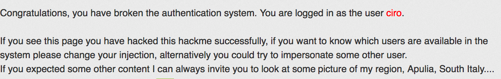
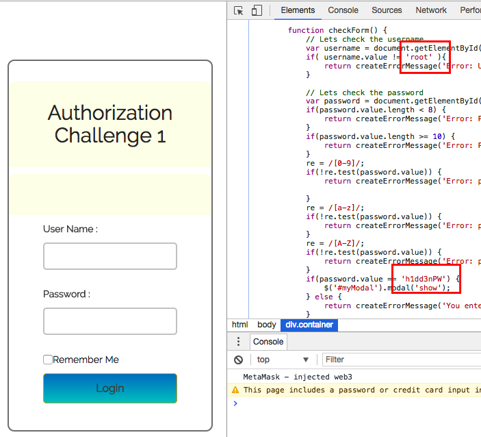
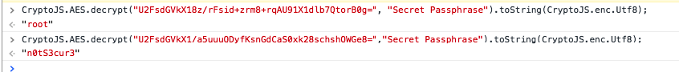

<div class='daily-hack-box'>
	<table class='table'>
		<thead>
		</thead>
		<tbody>
			<tr>
				<th scope='row'>Challenge</th>
				<td>Bypass 3 Separate Authentication Methods</td>
			</tr>
			<tr>
				<th scope='row'>Method</th>
				<td>Static Code Analysis<br>AES Decryption<br>SQL Injection</td>
			</tr>
			<tr>
				<th scope='row'>Link</th>
				<td>
                    <a class='table-link' target='_blank' href='https://hack.me/102854/security-project.html'>https://hack.me/102854/security-project.html</a>
                    <br>
                    <a class='table-link' target='_blank' href='https://hack.me/101099/sql-injections-bypassing-authentication-easy.html'>https://hack.me/101099/sql-injections-bypassing-authentication-easy.html</a>
                </td>
			</tr>
			<tr>
				<th scope='row'>Flag</th>
				<td>
                    
                </td>
			</tr>
		</tbody>
	</table>
</div>

### Daily Hack #5 Writeup
This problem ended up being super easy, so I'll blow through the writeup.

#### Step One
Greeted by a login page, all I had to do was open the dev tools and note the validation in the JS, unobfuscated, in the clear.  As you can see from below, the username is `root` and the password is `h1dd3nPW`.


<figure>
    
    <figcaption>Step One Access</figcaption>
</figure>


#### Step Two 
The same login screen is there to meet me.  Again, I open the dev tools and note the `auth.js` file.  There are a couple interesting lines in here, including:

```js
    var decryptedUser = CryptoJS.AES.decrypt("U2FsdGVkX18z/rFsid+zrm8+rqAU91X1dlb7QtorB0g=", "Secret Passphrase");
    var decryptedUserString = decryptedUser.toString(CryptoJS.enc.Utf8);
```

and

```js
    var decryptedPW = CryptoJS.AES.decrypt("U2FsdGVkX1/a5uuuQDyfKsnGdCaS0xk28schshQWGe8=","Secret Passphrase");
    var decryptedPWString = decryptedPW.toString(CryptoJS.enc.Utf8);
```

Okay, so the username and password are encrypted with AES.  Luckily, we have all the information we need to find both of them.  Open the web console and copy from the above lines into the console and we have our answers!

```js
CryptoJS.AES.decrypt("U2FsdGVkX18z/rFsid+zrm8+rqAU91X1dlb7QtorB0g=", "Secret Passphrase").toString(CryptoJS.enc.Utf8);
```

<figure>
    
    <figcaption>Step Two Access</figcaption>
</figure>

Our user is still `root` and our second step password is `n0tS3cur3`.  Indeed, this password is "not secure".


#### Step Three
Step Three directed me to another sandbox - hence the two links in my top description box.  This challenge has another login prompt, albeit different this time.  A login attempt shows me that there is a request to `login.php`.  When I try to go to `login.php`, I get a message:

<div class='text-response'>
    Missing username
</div>

 This means that I can use the URL/request parameters to attempt to login.

My first login attempt was:

```
[sandboxURL]/login.php?username=test&password=' or '1'='1
```

And it was that easy.


<div class='text-response'>
    Correct loginCiro
</div>

Then just access `index.php` which redirects to `private.php` I'm in!  Again, this challenge was pretty simple but some of the skills could be important to people new to penetration testing.


<figure>
    
    <figcaption>Step Three Access</figcaption>
</figure>


