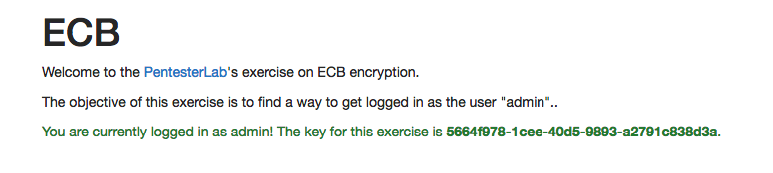
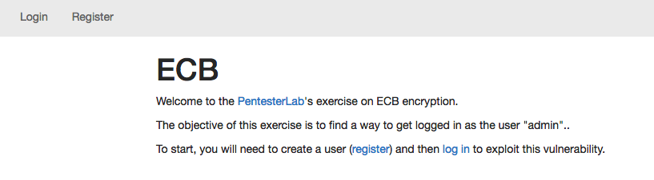
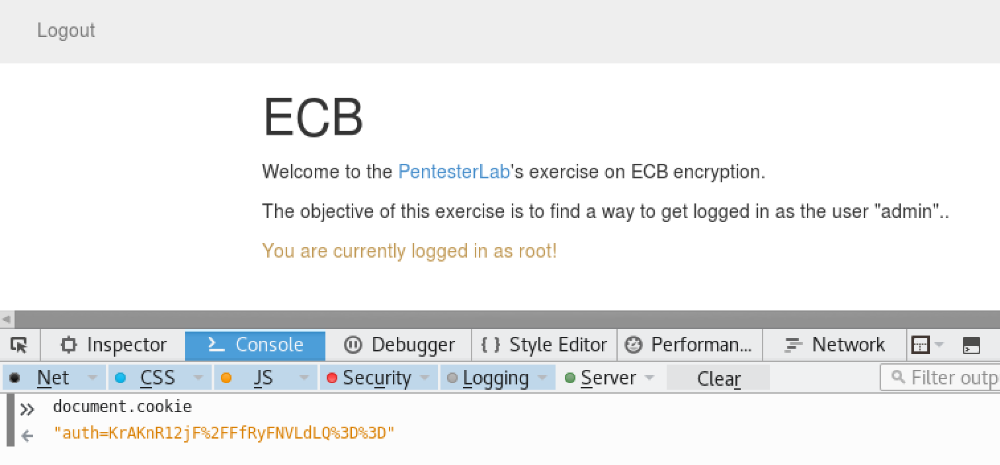
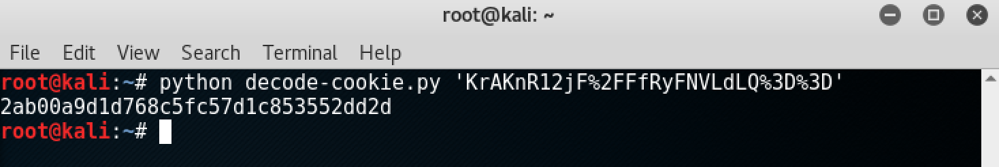
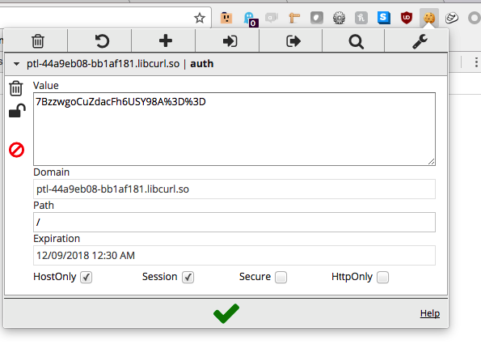

<div class='daily-hack-box'>
	<table class='table'>
		<thead>
		</thead>
		<tbody>
			<tr>
				<th scope='row'>Challenge</th>
				<td>Get authenticated as admin.</td>
			</tr>
			<tr>
				<th scope='row'>Badge</th>
				<td>White Badge (4 of 6)</td>			
			</tr>
			<tr>
				<th scope='row'>Method</th>
				<td>Replay attack exploiting ECB encryption mode.</td>
			</tr>
			<tr>
				<th scope='row'>Link</th>
				<td>
                    <a class='table-link' target='_blank' href='https://pentesterlab.com/exercises/ecb/online'>https://pentesterlab.com/exercises/ecb/online</a>
                </td>
			</tr>
				<th scope='row'>Flag</th>
				<td>
                	<figure>
					    
					</figure>
                </td>
			</tr>
		</tbody>
	</table>
</div>

### Daily Hack #14 Writeup


This exercise started off with a register and login screen as shown.

<figure>
    
    <figcaption>ECB Exercise Landing Page</figcaption>
</figure>

<br>


Opening Chrome's dev tools, I was able to track the cookies of my logged in users by entering `document.cookie` in the console tab. The first thing I did was login with the credentials `root` as the username and `toor` as the password. I checked to determine if the cookie changed with session by logging in twice.  It did not, which indicates that it is probably based off the username and password and not randomized per session.


<figure>
    
    <figcaption>Checking cookie for root</figcaption>
</figure>

<br>


The cookie, `auth=KrAKnR12jF%2FFfRyFNVLdLQ%3D%3D`, appears to be base64 based on the `%3D%3D` which translates to `==`.  My next step is to write two quick python files for decoding and encoding cookies.

<br>


<b>decode-cookie.py</b>
```python
import sys, urllib, base64

cookie = sys.argv[1]
print base64.b64decode(urllib.unquote(cookie).decode()).encode('hex')

```


<b>encode-cookie.py</b>
```python
import sys, urllib, base64

x = sys.argv[1]
print urllib.quote(base64.b64encode(x.decode('hex')))

```


<br>


Decoding the root/toor cookie doesn't actually tell me much.

<figure>
    
    <figcaption>Decoding root/toor cookie</figcaption>
</figure>

<br>

However, I do notice that the result is 16 bytes, which gives me an interesting idea.

```
1  2a b0 0a 9d 1d 76 8c 5f 
2  c5 7d 1c 85 35 52 dd 2d
```

Because I want to see which (if any) bytes are repeated, I create another user with an obscenely long username and password.  The username I selected is (24) a's and the password is (24) b's.

`aaaaaaaaaaaaaaaaaaaaaaaa/bbbbbbbbbbbbbbbbbbbbbbbb`

When I login, the cookie is:

```
"auth=9KG7Vr4LWlr0obtWvgtaWvShu1a%2BC1paCUW5U7iCT9njxTyjn3MXOePFPKOfcxc5"
```

And when I decode the cookie I get a result that's quite telling:

```
f4a1bb56be0b5a5af4a1bb56be0b5a5af4a1bb56be0b5a5a0945b953b8824fd9e3c53ca39f731739e3c53ca39f731739
```

Look closely. There are blocks of 8 bytes that are repeated with some random stuff on line 4. This means that the application uses a block size of 8 bytes.

```
1  f4 a1 bb 56 be 0b 5a 5a
2  f4 a1 bb 56 be 0b 5a 5a
3  f4 a1 bb 56 be 0b 5a 5a
4  09 45 b9 53 b8 82 4f d9
5  e3 c5 3c a3 9f 73 17 39
6  e3 c5 3c a3 9f 73 17 39
```


Next, I try varying the password length and reduce the username.  Now I'm using (16) a's for the username and (4) b's for the password.

`aaaaaaaaaaaaaaaa/bbbb`


The cookie is less total characters now:

```
"auth=9KG7Vr4LWlr0obtWvgtaWubtJmGZ9s0G"
```

Likewise, it's shorter decoded too:

```
f4a1bb56be0b5a5af4a1bb56be0b5a5ae6ed266199f6cd06
```

And now I am confident that the block size is 8 bytes and the username is the first part of the encrypted data.  Notice how the first 16 bytes remain the same as the previous login attempt.

```
1  f4 a1 bb 56 be 0b 5a 5a
2  f4 a1 bb 56 be 0b 5a 5a
3  e6 ed 26 61 99 f6 cd 06
```


Next, I'm going to attempt to login as admin without knowing the password simply by modifying a cookie that includes the username `admin`. For username, I use (8) a's followed by `admin` and the same (4) b's for the password.

`aaaaaaaaadmin/bbbb`

The cookie appears similar to previous cookies, but not identical:

```
"auth=9KG7Vr4LWlrsHPPCCgK5l1pwWHpRJj3w"
```

And I see a familiar first 8 bytes once decoded:

```
f4a1bb56be0b5a5aec1cf3c20a02b9975a70587a51263df0
```

The next step is to delete the first 8 bytes because they are simply the (8) a's we've appended.

```
1  f4 a1 bb 56 be 0b 5a 5a
2  ec 1c f3 c2 0a 02 b9 97
3  5a 70 58 7a 51 26 3d f0
```

After I deleted the first 8 bytes, I re-encoded through my python program.

```python
python encode-cookie.py ec1cf3c20a02b9975a70587a51263df0
```

And get `7BzzwgoCuZdacFh6USY98A%3D%3D`.  

<br>


Next, I must edit my `aaaaaaaaadmin` cookie using <b>Tamper Cookie</b>.
<br>


<figure>
    
    <figcaption>Tamper Cookie Edit</figcaption>
</figure>

<br>

Once I edit the cookie and refresh, I've solved the challenge!


<figure>
    
    <figcaption>Exercise Flag</figcaption>
</figure>

<br>

<br>


